# Lab Hari 1 — Asas AI, LLM & RAG + n8n Pertama

Lab ini mengiringi [`../README.md`](../README.md) Hari 1. Ikut latihan **secara berurutan** — setiap latihan bina di atas kefahaman latihan sebelumnya. Baca bahagian konsep yang sepadan dalam `README.md` dahulu, kemudian buat latihan di sini.

> **Peraturan lab:** Tulis/uji **sendiri** dahulu sebelum lihat jawapan atau minta bantuan. Cara paling berkesan belajar AI & n8n ialah **mencuba secara langsung** — bukan sekadar membaca.

> **Konvensyen:** Penerangan dalam **Bahasa Melayu**; nama *node* n8n, kunci JSON, prompt teknikal & istilah dikekalkan dalam **Bahasa Inggeris**.

---

## Senarai Semak Persediaan (Setup Checklist)

Sebelum mula Latihan 0, pastikan berikut sudah **✓** (banyak yang akan disediakan bersama semasa kelas):

- [ ] Komputer riba dengan pelayar web moden (Chrome/Edge/Firefox)
- [ ] Akses ke satu *instance* **n8n** — sama ada n8n Cloud (percubaan) **atau** n8n tempatan via Docker. Panduan pilih & sediakan kedua-dua jalan: [`../nota/10-setup-n8n.md`](../../nota/10-setup-n8n.md) (langkah penuh Docker: [`../nota/05-setup-docker.md`](../../nota/05-setup-docker.md), didalami Hari 2)
- [ ] Satu **kunci API OpenAI** *(atau)* **Ollama** tempatan yang berjalan — untuk node AI dalam Latihan 5
- [ ] Sambungan internet stabil

> Jika n8n belum sedia semasa Latihan 0–4, tak mengapa — Latihan 0–4 **tidak** perlukan n8n (ia latihan konsep, kertas & pelayar). Anda hanya perlukan n8n mulai **Latihan 5**. Minta bantuan fasilitator semasa rehat jika persediaan n8n bermasalah.

---

## Pengenalan n8n — Asas Dahulu, Kemudian JPJ

> 📺 Bahagian ini mengikut tutorial **["Master 80% of n8n in 36 Minutes"](https://www.youtube.com/watch?v=e3OV3LnrS7o)** (Futurepedia & AI Agent Lab) — asas n8n secara **umum**. Selepas faham asas ini, **Latihan 5 ke atas** kita aplikasikan corak yang **sama** kepada kes guna **JPJ** sebenar. Slaid penuh (self-contained): [`../../slides/n8n-fundamentals.html`](../../slides/n8n-fundamentals.html).

### Apa itu n8n?

**n8n** ialah platform automasi **berasaskan node** (*node-based*). Anda sambung kotak-kotak (*node*) menjadi satu aliran kerja (*workflow*) — tanpa menulis kod. Setiap workflow **bermula dengan satu pencetus (*trigger*)**, kemudian mengalir melalui node aksi / logik / AI sehingga menghasilkan sesuatu.

### Automation vs. Agent (konsep teras tutorial)

| **Automation** — TETAP | **AI Agent** — DINAMIK |
|------------------------|------------------------|
| Ikut turutan yang ditetapkan: `A → B → C` | Boleh **menaakul**, buat **keputusan**, pilih tindakan ikut konteks |
| Sama input → sama laluan, setiap kali | Seperti "pekerja digital" yang berfikir, ingat & bertindak |
| Sesuai untuk satu tugas jelas & berulang | Sesuai untuk soalan pelbagai jenis (Hari 3) |

### 5 Jenis Node Teras

Fahami lima kategori ini — anda faham **80%** setiap workflow. Di bawah ialah **kanvas contoh** (dibina sebenar dalam n8n) yang mengumpulkan setiap kategori dalam kotak *Sticky Note* berwarna:

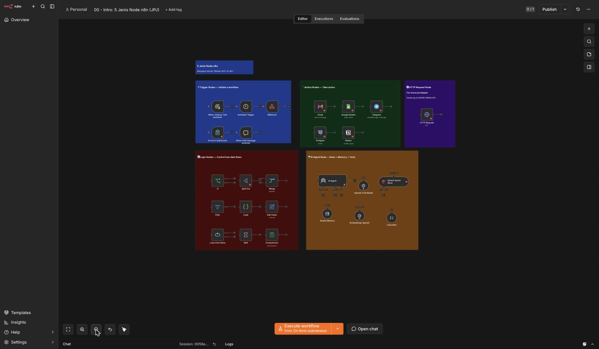

Contoh **dekat** kumpulan **Trigger** & **Action** (sama seperti dalam tutorial YouTube):

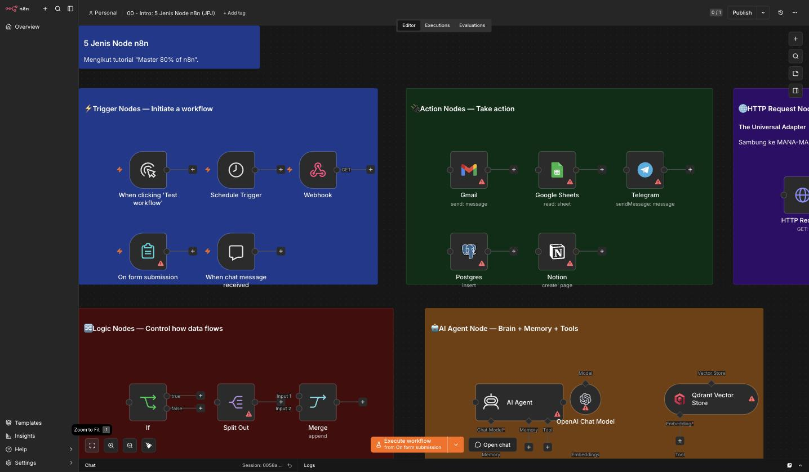

1. **⚡ Trigger Nodes** — *memulakan* workflow (Manual, Schedule, Webhook, Form, Chat).
2. **🔌 Action Nodes** — *buat kerja* melalui integrasi siap (Gmail, Google Sheets, Telegram, pangkalan data…).
3. **🌐 HTTP Request** — "penyesuai universal" untuk sambung ke **mana-mana API** walau tiada integrasi siap.
4. **🔀 Logic Nodes** — *kawal aliran data* (If, Switch, Merge, Filter, Loop, Code, Edit Fields…).
5. **🤖 AI Agent** — *otak + memori + tools*: LLM yang menaakul & memanggil alat (teras Hari 3).

> Dalam tutorial asal, penceramah bina **3 automasi** untuk tunjuk corak ini: (1) emel cuaca harian, (2) borang tajaan dengan logik bersyarat, (3) pembantu AI. **Kita ganti "cuaca/borang/tajaan" dengan konteks JPJ** — corak n8n yang sama, data & tujuan JPJ.

### Bagaimana ia menyambung ke kelas ini

- **Latihan 0–4** — orientasi & konsep (istilah, prompt, RAG manual) — masih tanpa n8n.
- **Latihan 5** — anda bina **workflow AI pertama** dalam n8n (Trigger → OpenAI → Response) — inilah "hello world" tutorial, tetapi soalan **JPJ**.
- **Latihan 6–16** — 12 kes guna JPJ (ringkas, kelas, ekstrak, terjemah, sentimen, dsb.) menggunakan corak yang sama.

✅ **Semakan:** Anda boleh terangkan (a) beza *automation* vs *agent*, dan (b) namakan **5 jenis node** dan satu contoh setiap satu — sebelum menyentuh n8n.

### 🧱 Warm-up — 6 Workflow Asas (satu bagi setiap jenis node)

Sebelum kes guna JPJ, cuba **import & jalankan** 6 workflow ringkas ini — setiap satu mengajar satu jenis node. Import dari [`../../templates/workflows/`](../../templates/workflows/) (menu **⋯** → *Import from File*):

| Templat | Ajar | Cuba |
|---------|------|------|
| `asas-1-hello.json` | Edit Fields (data) | Execute → lihat output |
| `asas-2-http-request.json` | HTTP Request | Panggil API awam, lihat JSON |
| `asas-3-if-branch.json` | IF (logik) | Tukar `jenis`, lihat cabang |
| `asas-4-chatbot.json` | AI (Basic LLM Chain) | Buka Chat, tanya soalan |
| `asas-5-webhook-echo.json` | Webhook | POST → balas balik |
| `asas-6-n8n-form.json` | n8n Form | Buka Form URL, isi & hantar |

> 📁 **Peta penuh templat → lab:** [`../../templates/workflows/README.md`](../../templates/workflows/README.md). Termasuk **3 build tutorial** "Master 80% of n8n" (cuaca, borang, pembantu AI) sebagai rujukan: `yt-1..3`.

✅ **Semakan:** Anda berjaya import & jalankan sekurang-kurangnya **satu** workflow asas, dan faham node mana mencetuskan (*trigger*) & node mana buat kerja (*action/logic/AI*).

---

## Latihan 0 — Orientasi (Alatan & Istilah)

**Objektif:** Kenali alatan & istilah teras sebelum menyentuh apa-apa yang teknikal.

1. Buka [platform.openai.com/tokenizer](https://platform.openai.com/tokenizer) dalam pelayar — alat ini kita guna di Latihan 2 untuk "melihat" token.
2. Buka [docs.n8n.io](https://docs.n8n.io) dan lihat sekilas antara muka kanvas n8n dalam dokumentasi — kenali perkataan **node**, **connection**, **trigger**, **credentials**.
3. Padankan istilah dengan maksud (jawab dalam kepala atau tulis):

   | Istilah | Maksud (padankan) |
   |---------|-------------------|
   | LLM | a. Kunci/rahsia untuk sambung perkhidmatan luar |
   | Token | b. Model AI yang meramal & menjana teks |
   | Embedding | c. "Kotak" tugas dalam n8n |
   | Node | d. Kepingan perkataan yang LLM proses |
   | Credentials | e. Teks ditukar jadi vektor nombor (makna) |

4. **Soalan renungan:** Kenapa kita belajar konsep AI/LLM/RAG **dahulu**, sebelum membina dalam n8n? (Jawapan: supaya anda faham **kenapa** setiap node wujud & **bila** untuk mempercayai jawapan AI — bukan sekadar menyalin langkah.)

> Jawapan padanan: LLM→b, Token→d, Embedding→e, Node→c, Credentials→a.

✅ **Semakan:** Anda boleh menerangkan dalam satu ayat setiap istilah: LLM, token, embedding, node, credentials.

---

## Latihan 1 — Bengkel: Kes Guna AI dalam JPJ

**Objektif:** Kenal pasti di mana AI benar-benar berguna dalam kerja harian JPJ (padanan 🧠 Bengkel SESI 1).

Buat secara **berkumpulan kecil** (2–3 orang) atau individu, di atas kertas/papan putih:

1. Senaraikan **5 soalan** yang orang awam / pegawai kaunter kerap tanya di bahagian anda. Contoh pencetus:
   - Pertanyaan **lesen** (pembaharuan LMM/CDL/GDL, kelayakan, dokumen diperlukan)
   - **Saman/kompaun** (cara semak tertunggak, kadar, rayuan)
   - **Pendaftaran/pindah milik** kenderaan (borang, langkah, bayaran)
   - Carian **SOP/pekeliling** dalaman (bantu pegawai baharu)
2. Bagi **setiap** soalan, tandakan:
   - **Sumber jawapan** — dari dokumen mana ia sepatutnya datang? (SOP? pekeliling? akta?)
   - **Kekerapan** — berapa kerap ditanya (tinggi/sederhana/rendah)?
   - **Risiko silap** — apa jadi jika jawapan salah (tinggi/rendah)?
3. Bulatkan **1–2 kes** paling bernilai untuk automasi: **kerap ditanya + jawapan ada dalam dokumen + faedah besar bila betul**.

| Soalan lazim | Sumber dokumen | Kekerapan | Risiko silap | Calon automasi? |
|--------------|----------------|-----------|--------------|-----------------|
| *(contoh)* Berapa lama boleh perbaharui lesen lebih awal? | SOP pelesenan | Tinggi | Sederhana | ✅ |
| … | … | … | … | … |

4. **Perbincangan:** Kenapa kes yang "kerap + berpaksikan dokumen" ialah calon terbaik? (Petunjuk: RAG paling bersinar bila jawapan **sudah ada** dalam dokumen rasmi — kita cuma perlu **mencari & memetiknya**.)

✅ **Semakan:** Kumpulan anda menghasilkan **sekurang-kurangnya 5 soalan JPJ** dengan sumber dokumen, dan telah memilih **1–2 kes teratas** untuk automasi dengan alasan yang jelas.

---

## Latihan 2 — Bengkel Prompt Engineering (Soalan Gaya-JPJ)

**Objektif:** Rasa sendiri bagaimana **cara menulis prompt** mengubah kualiti jawapan — dan lihat **halusinasi** berlaku (padanan 💻 Latihan SESI 2). Gunakan **mana-mana** LLM yang ada akses: ChatGPT, Claude, Gemini, atau node AI dalam n8n.

### 2.1 — Lihat token

1. Buka [platform.openai.com/tokenizer](https://platform.openai.com/tokenizer).
2. Taip ayat gaya-JPJ, cth: `Prosedur pembaharuan lesen memandu kelas D yang telah tamat tempoh melebihi tiga tahun`.
3. Perhatikan **bilangan token** dan cara perkataan dipecah. Cuba ayat pendek vs panjang — sahkan sendiri: **lebih panjang = lebih banyak token**.

> **Kaitan RAG:** inilah sebab kita **tak boleh** tampal semua dokumen JPJ ke satu prompt — terlalu banyak token untuk *context window*. RAG hanya suntik **petikan relevan**.

### 2.2 — Prompt lemah lawan prompt kuat

Tanya LLM soalan gaya-JPJ dengan **dua** cara, banding jawapannya:

**Prompt LEMAH (kabur):**
```
Macam mana nak tukar geran kereta?
```

**Prompt KUAT (jelas + peranan + format + sempadan):**
```
Anda pembantu maklumat JPJ untuk pegawai kaunter.
Terangkan langkah pindah milik kenderaan persendirian kepada individu lain,
dalam 5 langkah bernombor, bahasa mudah untuk orang awam.
Jika ada langkah yang anda tidak pasti, nyatakan "sila sahkan dengan kaunter JPJ"
— jangan reka nombor bayaran atau nama borang.
```

Perhatikan perbezaan: prompt kuat beri **peranan**, **format** (5 langkah bernombor), dan **sempadan** (jangan reka).

### 2.3 — Saksikan halusinasi

Tanya LLM **tanpa** memberi apa-apa dokumen:
```
Berapa kadar kompaun tepat bagi lesen memandu yang tamat tempoh selama 3 tahun di Malaysia?
```

Perhatikan: LLM mungkin beri **nombor yang kelihatan yakin**. **Anda tiada cara untuk tahu ia betul** — ia mungkin **direka** (halusinasi). Inilah bahayanya LLM biasa untuk kerja JPJ.

### 2.4 — Kesan "buku terbuka" (pra-RAG secara manual)

Sekarang **tampal petikan** dahulu, kemudian tanya — tiru cara RAG bekerja secara manual:
```
KONTEKS (petikan SOP contoh — data latihan, bukan rasmi):
"Pembaharuan lesen boleh dibuat seawal 3 bulan sebelum tarikh tamat.
 Lesen yang tamat melebihi 3 tahun memerlukan ujian semula (JPJ L2/L5)."

ARAHAN: Jawab soalan berikut BERDASARKAN KONTEKS DI ATAS SAHAJA.
Jika jawapan tiada dalam konteks, katakan "maklumat tidak dinyatakan dalam sumber".

SOALAN: Adakah lesen yang tamat 4 tahun perlu ujian semula?
```

Perhatikan: sekarang jawapan **berpaksikan petikan** yang anda beri, dan boleh dirujuk balik. **Inilah intipati RAG** — Hari 2 kita automatikkan langkah "cari & tampal petikan" ini.

✅ **Semakan:** Anda dapat: (1) tunjuk prompt kuat menghasilkan jawapan lebih baik daripada prompt lemah, (2) saksikan satu contoh halusinasi (nombor direka), dan (3) buktikan jawapan jadi lebih boleh-dipercayai apabila petikan sumber diberi dahulu.

---

## Latihan 3 — Reka Pembantu Pengetahuan untuk Bahagian Anda

**Objektif:** Lakar reka bentuk pembantu RAG untuk bahagian **anda sendiri** — di atas kertas, belum dalam n8n (padanan 👥 Aktiviti SESI 3).

Isi kanvas reka bentuk ringkas ini:

1. **Nama pembantu:** _(cth. "Pembantu Pelesenan Cawangan")_
2. **Pengguna sasaran:** _(pegawai kaunter? orang awam? pegawai baharu?)_
3. **Dokumen sumber** (3–5): _(SOP mana? pekeliling? prosedur? — guna dokumen contoh, jangan dokumen sulit sebenar)_
4. **5 soalan contoh** yang pembantu mesti boleh jawab: _(ambil dari Latihan 1)_
5. **Bentuk jawapan yang diharapkan:** _(ringkas? bernombor? mesti petik sumber?)_
6. **Lukis pipeline RAG anda** — isi kotak dengan konteks bahagian anda:

```
Soalan pengguna:  "________________________________"
      │
      ▼
   [Embedding]  →  [Vector Search dalam Qdrant]  →  [Petikan relevan]
      │                                                    │
      └───────────────────────┬────────────────────────────┘
                              ▼
                       [LLM + prompt]
                              │
                              ▼
   Jawapan + petikan sumber:  "________________________________
                               (Sumber: __________, perenggan ___)"
```

7. **Semakan risiko:** Adakah dokumen sumber anda sensitif? Jika ya — tandakan bahawa **Ollama + on-premise** (bukan OpenAI cloud) ialah pilihan yang lebih selamat (didalami Hari 3).

✅ **Semakan:** Anda menghasilkan **satu lakaran pembantu** lengkap: nama, pengguna, 3–5 dokumen sumber, 5 soalan, bentuk jawapan, dan pipeline RAG yang dilukis dengan konteks bahagian anda.

---

## Latihan 4 — Demo: Visualisasi Carian Semantik

**Objektif:** "Rasai" cara embeddings menyusun teks mengikut **makna**, bukan perkataan (padanan 🔎 Demo SESI 4). Latihan kertas — tiada kod.

Diberi satu **ayat rujukan** dan beberapa **calon**. Tugas anda: susun calon dari **paling serupa makna** hingga **paling berbeza**, seperti yang embeddings akan lakukan (skor cosine similarity tinggi → rendah).

**Ayat rujukan:** `"Bagaimana cara memperbaharui lesen memandu?"`

**Calon:**
```
A. "Prosedur pembaharuan lesen memandu"
B. "How do I renew my driving licence?"
C. "Cara membayar saman trafik tertunggak"
D. "Langkah menukar hak milik kenderaan"
E. "Renew driving license steps"
```

1. Susun A–E dari **paling hampir** maknanya kepada **paling jauh** berbanding ayat rujukan.
2. Perhatikan: **B & E dalam bahasa Inggeris** tetapi maknanya **hampir sama** dengan rujukan — embeddings sepatutnya letak mereka **tinggi**, walaupun perkataannya berlainan bahasa. Inilah **carian semantik**.
3. **C & D** tentang topik JPJ lain (saman, pindah milik) — makna **berbeza**, jadi skor **rendah** walaupun sama-sama domain JPJ.

> **Susunan jangkaan** (paling serupa → paling jauh): **A, B, E** (semua tentang pembaharuan lesen — merentas bahasa) → kemudian **D**, **C** (topik JPJ berbeza). Carian kata kunci biasa akan **terlepas** B & E kerana ejaan berbeza — carian semantik **tidak**.

4. **Perbincangan:** Kenapa keupayaan memadan **merentas bahasa & ayat berbeza** ini penting untuk kaunter JPJ? (Petunjuk: orang awam bertanya dengan seribu satu cara & bahasa berbeza.)

✅ **Semakan:** Anda boleh menerangkan **mengapa** ayat Inggeris B & E patut mendapat skor persamaan tinggi dengan soalan BM — iaitu embeddings memadankan **makna**, bukan perkataan/ejaan.

---

## Latihan 5 — Bina Workflow AI Pertama (Webhook → AI → Response)

**Objektif:** Bina *API endpoint* berkuasa AI pertama anda dalam n8n (padanan 💻 Lab SESI 5). Inilah puncak Hari 1.

> **Ingat:** *workflow* ini menjawab dari **pengetahuan umum model sahaja** — ia **belum RAG**, jadi **belum** untuk jawapan JPJ sebenar. Tujuannya membiasakan anda dengan **mekanik n8n**: cipta workflow, tambah node, set credentials, sambung, execute. RAG datang Hari 2.

### 5.1 — Cipta workflow baharu

1. Buka n8n (Cloud atau tempatan).
2. Klik **+ (New Workflow)** / **Add workflow**.
3. Namakan workflow: klik tajuk di atas → taip `Hari 1 - First AI Workflow` → simpan (**Save**).

> 📸 Skrin di bawah dirakam daripada **n8n tempatan sebenar** (`localhost:5678`). Selepas klik **Build a workflow**, anda tiba di **kanvas kosong** ("Add first step…"):

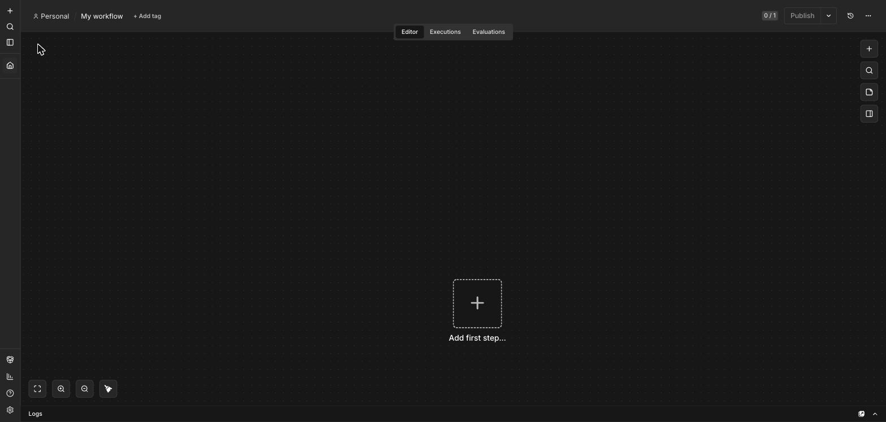

### 5.2 — Tambah node pencetus (Trigger)

Kita mula dengan **Manual Trigger** dahulu (paling mudah untuk uji), kemudian tukar ke **Webhook**.

1. Pada kanvas kosong, klik **+** (atau "Add first step").
2. Pilih **Manual Trigger** (*"Trigger manually"*) — ini membolehkan anda tekan butang untuk menguji tanpa perlu URL luaran dahulu.

Apabila anda klik **+**, panel **"What triggers this workflow?"** muncul — pilih **Trigger manually**:

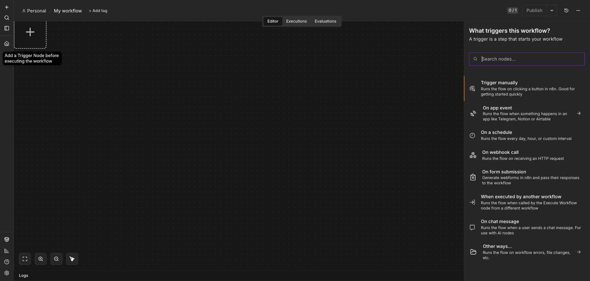

Node **Manual Trigger** ("When clicking 'Execute workflow'") kini berada di kanvas:

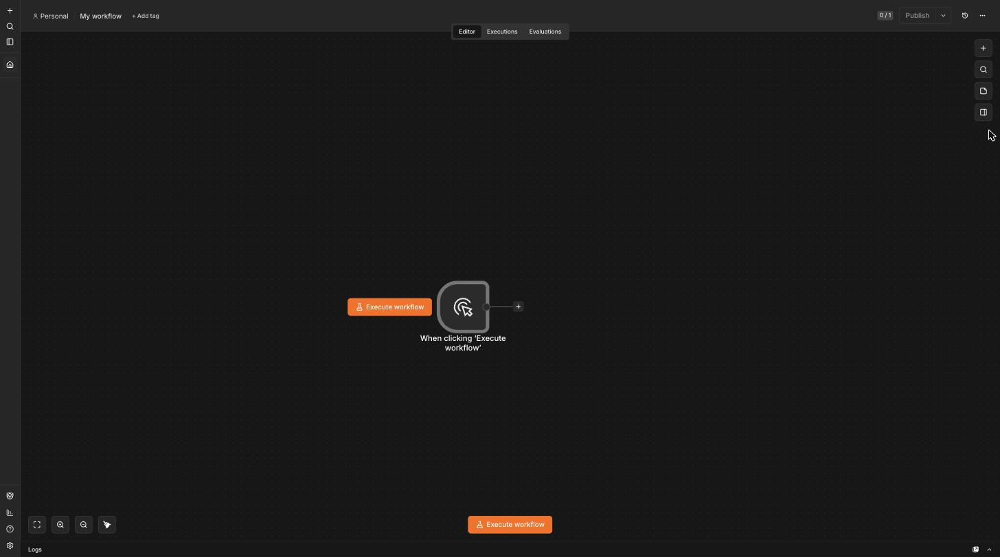

> **Kenapa Manual Trigger dulu?** Ia memudahkan ujian semasa membina. Selepas workflow berjalan, kita tukar kepada **Webhook** supaya boleh dipanggil dari luar (langkah 5.7).

### 5.3 — Tambah node AI / OpenAI

1. Klik **+** pada output *Manual Trigger*.
2. Cari & pilih node **OpenAI** (atau **AI**/**Basic LLM Chain** bergantung versi n8n anda).

Taip `OpenAI` dalam carian node — anda nampak **OpenAI** & **OpenAI Chat Model**:

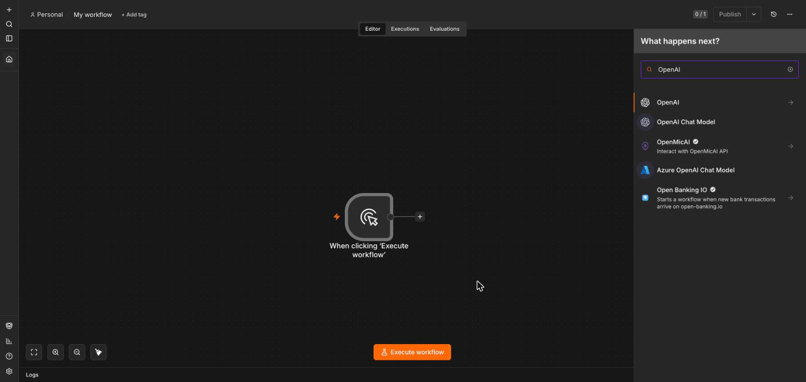

3. Pilih operasi **Message a model** / **Chat** (menghantar mesej ke model & terima jawapan).

### 5.4 — Set credentials (kunci API)

1. Dalam node OpenAI, pada medan **Credential**, klik **Create New Credential**.
2. Tampal **kunci API OpenAI** anda → **Save**.
3. n8n menyimpan kunci ini **disulitkan & berasingan** — anda tak perlu taip semula; ia boleh **guna semula** dalam node lain kemudian.

Node **"Message a model"** dengan medan **Credential** (klik **"Set up credential"** untuk tampal kunci anda):

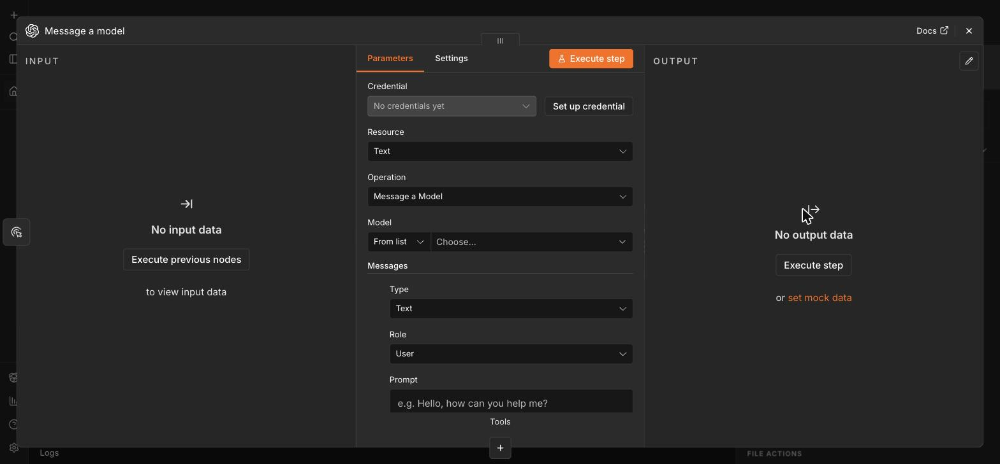

> **Guna Ollama sebaliknya?** Pilih model Ollama tempatan dan tetapkan *base URL* Ollama (cth. `http://localhost:11434`) — jawapan tak keluar dari mesin anda. Sesuai untuk data sensitif JPJ.

> **Keselamatan:** **Jangan** taip kunci API terus dalam mana-mana medan teks/prompt atau kongsi dalam mesej — sentiasa guna sistem **Credential**. Rujuk [`../nota/08-governance-keselamatan.md`](../../nota/08-governance-keselamatan.md).

### 5.5 — Tetapkan model & prompt

1. **Model:** pilih model chat (cth. `gpt-4o-mini` — murah & pantas untuk belajar).
2. **Prompt / Message:** masukkan satu prompt bergaya-JPJ, cth:
   ```
   Anda pembantu maklumat mesra untuk kaunter JPJ.
   Jawab soalan pengguna dalam Bahasa Melayu yang mudah, ringkas (2-4 ayat).
   Jika anda tidak pasti fakta rasmi (kadar, nombor borang), nasihatkan pengguna
   sahkan dengan kaunter JPJ — jangan reka nombor.

   Soalan: Apakah maksud pindah milik kenderaan?
   ```

Selepas set **Credential** (OpenAI account), **Model** (`GPT-4O-MINI`) & **Prompt**, node kelihatan begini *(contoh prompt: "Dalam 2 ayat, terangkan tujuan utama JPJ Malaysia")*:

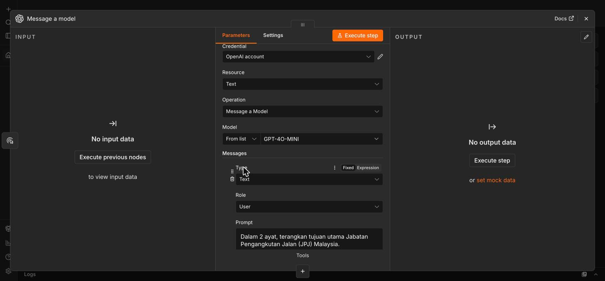

### 5.6 — Sambung node & execute

1. Pastikan wayar (*connection*) menyambung **Manual Trigger → OpenAI** (tarik dari bulatan output trigger ke node OpenAI jika belum tersambung).
2. Klik **Execute Workflow** (atau **Test workflow**).
3. Klik node **OpenAI** → tab **Output**. Anda patut lihat **jawapan model** dalam bentuk JSON — cari medan seperti `message.content` / `text` / `response`.

**Apa yang anda patut nampak:** satu jawapan teks daripada AI dalam BM ringkas. Jika ada **ralat merah** — baca mesejnya (selalunya *credentials* salah, kunci API tiada kredit, atau tiada internet).

Panel **OUTPUT** (✓ hijau) menunjukkan jawapan AI — `status: completed`, `text: ...`:

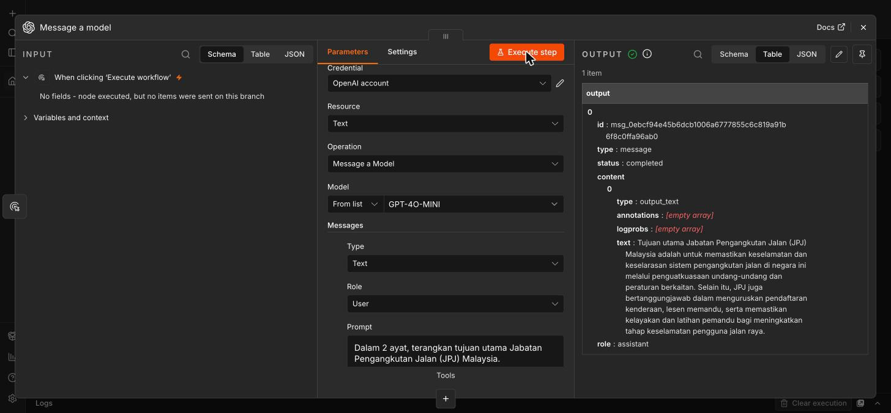

Pada kanvas, **kedua-dua node hijau** (✓) dengan "1 item" mengalir antara mereka — workflow berjaya:

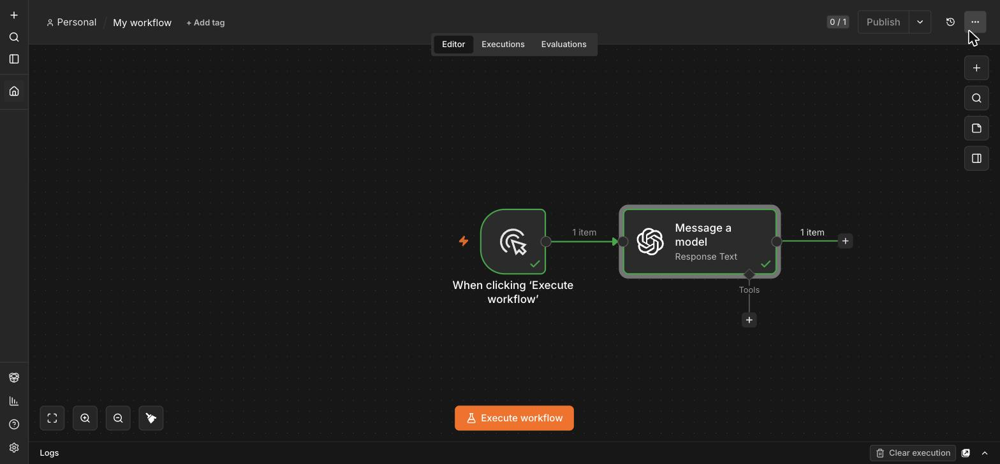

### 5.7 — Naik taraf ke Webhook + Response (jadikan ia "endpoint")

Sekarang jadikan ia *API endpoint* sebenar yang boleh dipanggil dari luar:

1. **Padam** *Manual Trigger*, tambah node **Webhook** sebagai pencetus. Set **HTTP Method** = `POST`, dan salin **URL webhook** (mod *Test*).
2. Sambung **Webhook → OpenAI**.
3. Ubah prompt supaya soalan datang dari data webhook — guna ungkapan n8n untuk ambil medan yang dihantar, cth: `{{ $json.body.question }}` sebagai soalan (bukannya soalan tetap).
4. Tambah node **Respond to Webhook** selepas OpenAI → sambung **OpenAI → Respond to Webhook**. Ini memulangkan jawapan AI sebagai respons HTTP.
5. Bentuk akhir:
   ```
   Webhook  ───►  OpenAI  ───►  Respond to Webhook
   (POST: {question})   (jana jawapan)    (pulangkan jawapan)
   ```
6. Klik **Execute/Listen**, kemudian hantar soalan ke URL webhook (guna butang "Test" n8n, atau alat seperti Postman/`curl`) dengan badan JSON:
   ```json
   { "question": "Berapa lama tempoh sah lesen memandu penuh?" }
   ```
7. Sahkan anda menerima **jawapan AI** sebagai respons.

> **Templat rujukan:** Bandingkan workflow anda dengan templat penuh yang boleh diimport: `../templates/workflows/01-first-ai-workflow.json`. Import melalui menu n8n (**⋮ → Import from File**) untuk melihat versi lengkap.

✅ **Semakan:** Workflow anda **execute tanpa ralat merah**, node OpenAI memaparkan jawapan AI dalam Output, dan (bahagian Webhook) menghantar soalan JSON ke URL memulangkan jawapan sebagai respons HTTP. Anda telah membina *API endpoint* berkuasa AI pertama anda. 🎉

---

## 🧩 Latihan 6–16 — Kes Guna AI JPJ (Sesi Hands-On Penuh)

Sekarang anda tahu **mekanik n8n**, mari lihat **kepelbagaian** tugas AI yang berguna untuk JPJ. Semua latihan ini **guna corak yang SAMA** seperti Latihan 5 (`Manual Trigger → OpenAI "Message a model"`) — anda hanya **tukar prompt** dan baca output. Ini "tugas bahasa" (*language tasks*) klasik — peta terus ke **buku rujukan Bab 4–5** ([`../nota/00-rujukan-buku.md`](../../nota/00-rujukan-buku.md)).

> **Cara pantas:** Dalam n8n, **duplicate** workflow Latihan 5 (menu ⋯ → Duplicate) untuk setiap kes guna, ATAU cuma **tukar teks Prompt** dalam node OpenAI sedia ada dan klik **Execute step** semula. *Credential* OpenAI anda **diguna semula** — tak perlu set semula.

| Latihan | Kes guna JPJ | Tugas AI (Bab buku) | Kenapa berguna untuk JPJ |
|---------|--------------|----------------------|---------------------------|
| 6 | Peringkas Pekeliling | Summarization (Bab 4) | Pegawai faham pekeliling panjang dalam saat |
| 7 | Pengelas Pertanyaan | Classification (Bab 4) | Hala pertanyaan ke kaunter/bahagian betul |
| 8 | Pengekstrak Maklumat | Information Extraction (Bab 4) | Auto-isi borang daripada teks bebas |
| 9 | Penterjemah Notis | Machine Translation (Bab 4) | Notis awam BM ↔ EN |
| 10 | Webhook API Endpoint | Deployment (Bab 9) | Sambung pembantu ke laman/aplikasi |
| 11 | Analisis Sentimen | Sentiment Analysis (Bab 4) | Triage aduan/maklum balas awam |
| 12 | Draf Balasan Rasmi | Text Generation (Bab 5) | Bantu pegawai jawab aduan (semak dulu) |
| 13 | Semakan Kelayakan | Reasoning (Bab 5) | Semak syarat kelayakan (bantu, bukan putus) |
| 14 | Padanan Niat & Hala Tuju | Classification/Routing (Bab 4) | Auto-halakan pertanyaan ke bahagian betul |
| 15 | Penjana Senarai Semak | Text Generation (Bab 5) | Checklist dokumen kemas untuk kaunter |
| 16 | Penerang Istilah | Text Generation (Bab 5) | Ayat rasmi/Akta jadi bahasa mudah orang awam |

> ⏱️ **Setiap latihan ±20–40 minit** — cukup mengisi sesi hands-on penuh (±11 kes guna). Buat mengikut masa; Latihan 6–8, 11 & 14–16 paling praktikal untuk JPJ (Latihan 9–10 pilihan/lanjutan).

---

### Latihan 6 — Peringkas Pekeliling JPJ (Summarization)

**Objektif:** Guna AI untuk memendekkan pekeliling/SOP panjang kepada beberapa poin — pegawai kaunter tak perlu baca keseluruhan.

**Pipeline:** `Manual Trigger → OpenAI (Message a model)`

1. Guna node OpenAI yang sama — tukar **Prompt** kepada:
   ```
   Ringkaskan teks pekeliling JPJ berikut kepada 4 poin utama (bullet) dalam
   Bahasa Melayu ringkas:

   Semua pemohon lesen memandu kelas D hendaklah mengemukakan salinan kad
   pengenalan, dua keping gambar berukuran pasport, dan laporan kesihatan
   daripada klinik berdaftar. Ujian teori (KPP) mesti diluluskan sebelum ujian
   amali. Bayaran proses sebanyak RM20 dikenakan dan tidak dikembalikan.
   Pemohon berumur bawah 17 tahun tidak layak memohon.
   ```
2. Klik **Execute step** → baca panel **Output**.

**Output dijangka:** 4 poin bullet ringkas (dokumen, ujian KPP, bayaran RM20, had umur). Skrin sebenar daripada n8n tempatan:

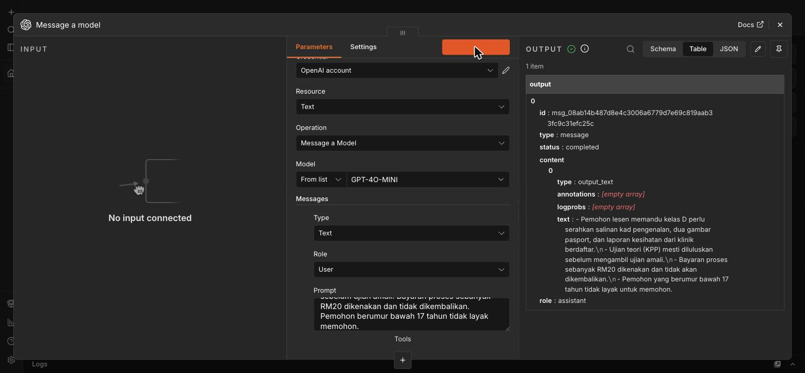

✅ **Semakan:** Output mengandungi **poin-poin ringkas** yang menangkap **semua fakta penting** teks asal (dokumen, KPP, RM20, umur), tanpa menokok fakta baharu.

---

### Latihan 7 — Pengelas Pertanyaan Orang Awam (Classification)

**Objektif:** Kelaskan pertanyaan masuk kepada kategori (Lesen / Pendaftaran / Saman / Lain) — asas untuk **menghalakan** ke bahagian betul secara automatik.

1. Tukar **Prompt** kepada:
   ```
   Kelaskan pertanyaan orang awam berikut kepada SATU kategori sahaja:
   Lesen, Pendaftaran, Saman, atau Lain. Balas hanya nama kategori.
   Pertanyaan: "Macam mana nak tukar nama pemilik kereta dalam geran?"
   ```
2. **Execute step**.

**Output dijangka:** `Pendaftaran`. Skrin sebenar:

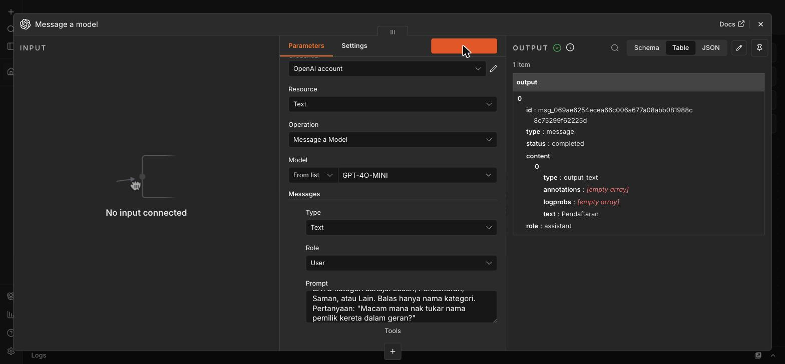

Cuba **tukar pertanyaan** dan lihat kategori berubah:
- *"Saya nak semak saman tertunggak"* → `Saman`
- *"Bila lesen P saya boleh tukar ke CDL?"* → `Lesen`

✅ **Semakan:** Model memulangkan **satu kategori sahaja** (bukan ayat panjang) dan memilih kategori yang **munasabah** untuk setiap pertanyaan.

---

### Latihan 8 — Pengekstrak Maklumat → JSON (Information Extraction)

**Objektif:** Tukar teks bebas (cth. aduan/permohonan) kepada **data berstruktur (JSON)** yang boleh dimasukkan ke sistem/borang lain.

1. Tukar **Prompt** kepada:
   ```
   Ekstrak maklumat daripada teks berikut sebagai JSON dengan kunci:
   nama, no_kp, jenis_urusan. Balas JSON sahaja, tiada teks lain.
   Teks: "Saya Ahmad bin Ali, No. KP 900101-14-5566, ingin memperbaharui
   lesen memandu saya."
   ```
2. **Execute step**.

**Output dijangka:** JSON seperti `{"nama":"Ahmad bin Ali","no_kp":"900101-14-5566","jenis_urusan":"memperbaharui lesen memandu"}`. Skrin sebenar:

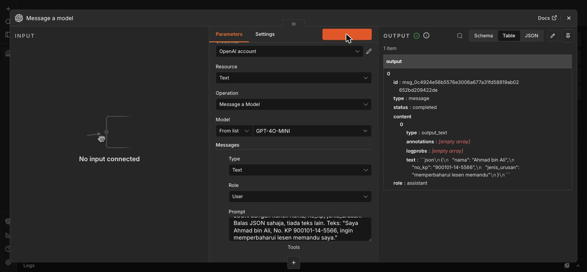

> **Kenapa JSON penting?** Output berstruktur ini boleh terus disambung ke node lain (Google Sheets, Postgres, borang) — inilah cara AI "bercakap" dengan sistem lain. Kita guna corak ini semula pada Hari 2 (metadata) & Hari 3 (tools ejen).

✅ **Semakan:** Output ialah **JSON sah** dengan ketiga-tiga kunci (`nama`, `no_kp`, `jenis_urusan`) terisi betul daripada teks.

---

### Latihan 9 — Penterjemah Notis (Machine Translation)

**Objektif:** Terjemah notis/arahan JPJ antara **Bahasa Melayu ↔ English** untuk orang awam pelbagai bahasa.

1. Tukar **Prompt** kepada:
   ```
   Terjemah notis JPJ berikut ke dalam English yang formal dan jelas:
   "Sila pastikan cukai jalan dan insurans kenderaan anda sah sebelum
   memandu di jalan raya. Memandu tanpa cukai jalan yang sah adalah satu
   kesalahan di bawah Akta Pengangkutan Jalan 1987."
   ```
2. **Execute step**.

**Output dijangka:** terjemahan English yang formal & tepat maksud. Skrin sebenar (perhatikan istilah rasmi diterjemah betul — *road tax*, *Road Transport Act 1987*):

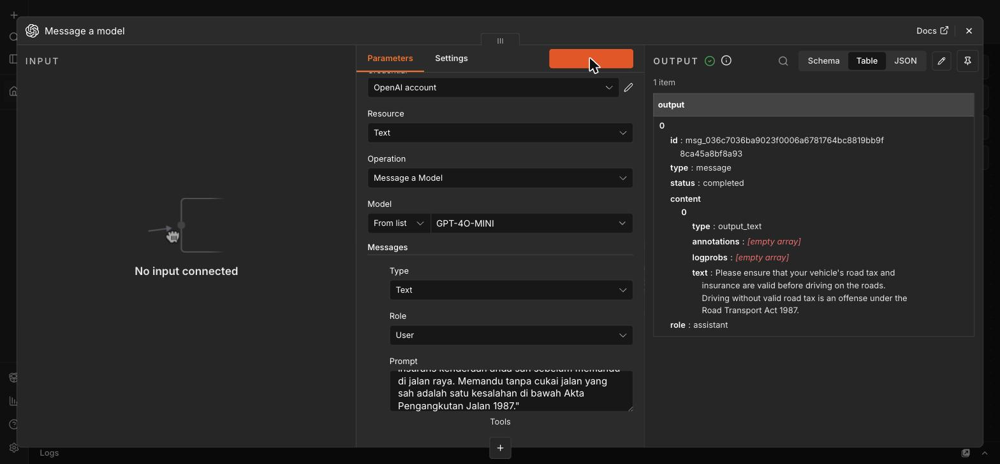

Cuba juga arah sebaliknya (English → BM).

✅ **Semakan:** Terjemahan **mengekalkan maksud** asal, nada **formal**, dan istilah rasmi (cukai jalan → *road tax*, Akta Pengangkutan Jalan 1987 → *Road Transport Act 1987*) betul.

---

### Latihan 10 — Webhook API Endpoint (Kes Guna Produksi)

**Objektif:** Jadikan pembantu Q&A (Latihan 5) satu **API endpoint sebenar** yang boleh dipanggil dari laman web/aplikasi — bukan sekadar butang dalam n8n.

**Pipeline:**
```
Webhook  ───►  OpenAI (Message a model)  ───►  Respond to Webhook
(POST)         (soalan dari body)               (pulangkan jawapan)
```

1. **Padam** *Manual Trigger*; tambah node **Webhook** sebagai pencetus. Set **HTTP Method** = `POST`, dan set **Respond** = *"Using 'Respond to Webhook' Node"*. Node Webhook memaparkan **Test URL** — inilah alamat *endpoint* anda:

   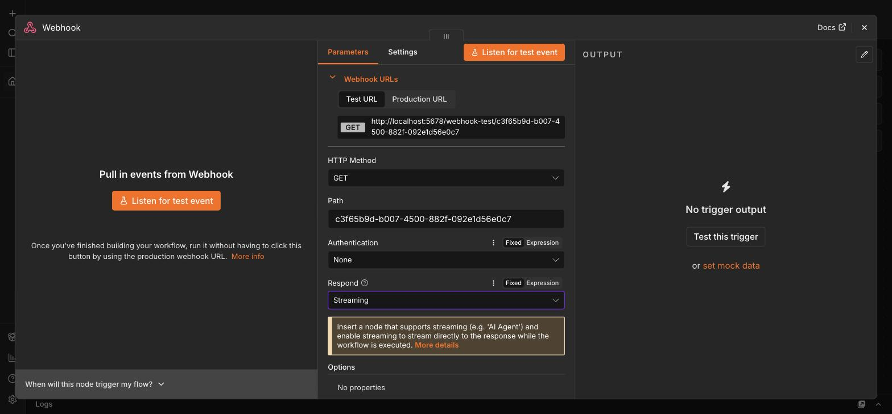
2. Sambung **Webhook → OpenAI**.
3. Dalam node OpenAI, ubah **Prompt** supaya soalan datang dari data webhook — guna **Expression**:
   ```
   {{ $json.body.question }}
   ```
4. Tambah node **Respond to Webhook** selepas OpenAI; sambung **OpenAI → Respond to Webhook** (medan respons = jawapan model).
5. Klik **Listen for Test Event**, kemudian hantar POST (dari terminal):
   ```bash
   curl -X POST <TEST_URL_ANDA> \
     -H "Content-Type: application/json" \
     -d '{"question":"Apakah maksud pindah milik kenderaan?"}'
   ```

✅ **Semakan:** Panggilan `curl` memulangkan **jawapan AI sebagai respons HTTP**. Anda kini ada *endpoint* yang boleh disambung ke mana-mana laman/aplikasi — asas *deployment* sebenar (didalami Hari 3, SESI 15).

---

### Latihan 11 — Analisis Sentimen Maklum Balas (Sentiment Analysis)

**Objektif:** Triage maklum balas orang awam secara automatik — kenal pasti **sentimen** & **keutamaan** supaya aduan kritikal dapat perhatian segera.

1. Tukar **Prompt** kepada:
   ```
   Analisis maklum balas orang awam berikut. Balas dalam format:
   Sentimen (Positif/Negatif/Neutral), Keutamaan (Tinggi/Sederhana/Rendah),
   dan Ringkasan isu dalam 1 ayat.
   Maklum balas: "Saya sangat kecewa! Sudah 3 kali datang kaunter JPJ tetapi
   sistem down, buang masa saya seharian."
   ```
2. **Execute step**.

**Output dijangka:** `Sentimen: Negatif`, `Keutamaan: Tinggi`, + ringkasan isu. Skrin sebenar:

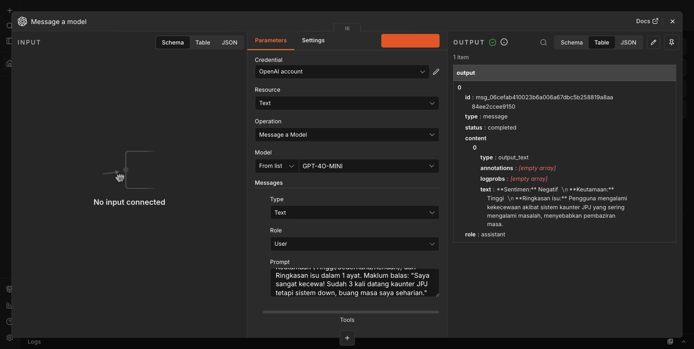

✅ **Semakan:** Model mengesan sentimen **Negatif** & keutamaan **Tinggi** untuk aduan kecewa ini, dengan ringkasan isu yang tepat. Cuba maklum balas positif — sentimen patut bertukar.

---

### Latihan 12 — Draf Balasan Rasmi (Text Generation)

**Objektif:** Jana **draf balasan** sopan & berempati kepada aduan orang awam — pegawai semak & hantar (bukan auto-hantar).

1. Tukar **Prompt** kepada:
   ```
   Draf balasan rasmi yang sopan dalam Bahasa Melayu kepada aduan orang awam
   berikut. Gunakan nada empati dan profesional, mohon maaf, tawarkan langkah
   seterusnya, maksimum 4 ayat.
   Aduan: "Saya sangat kecewa, sistem kaunter JPJ down 3 kali dan saya tak
   dapat perbaharui lesen memandu saya."
   ```
2. **Execute step**.

**Output dijangka:** surat balasan rasmi BM lengkap (mohon maaf, langkah seterusnya, penutup rasmi). Skrin sebenar:

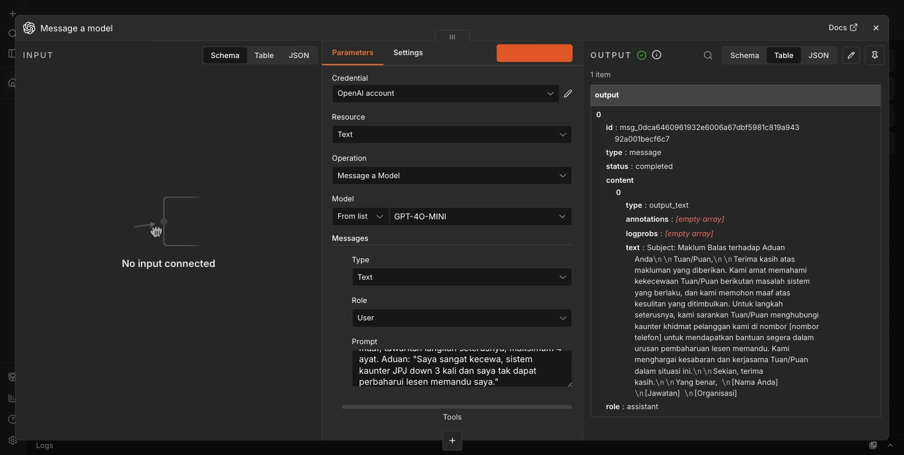

> ⚠️ **Human-in-the-loop:** draf AI **mesti disemak pegawai** sebelum dihantar — AI membantu menulis, pegawai bertanggungjawab atas isi. Prinsip ini penting untuk komunikasi rasmi kerajaan (lihat [`../nota/08-governance-keselamatan.md`](../../nota/08-governance-keselamatan.md)).

✅ **Semakan:** Output ialah surat BM rasmi yang **sopan, berempati, mohon maaf & menawarkan langkah seterusnya** — sedia untuk pegawai semak & perhalusi.

---

### Latihan 13 — Semakan Kelayakan (Reasoning)

**Objektif:** Guna AI untuk **menaakul** terhadap satu set syarat — cth. semak sama ada pemohon memenuhi syarat kelayakan. Ini menunjukkan AI bukan sekadar "menjana teks" tetapi boleh **memeriksa peraturan**.

1. Tukar **Prompt** kepada:
   ```
   Anda pembantu penyemak kelayakan JPJ. Syarat lesen memandu kelas D:
   (1) berumur sekurang-kurangnya 17 tahun, (2) telah lulus Ujian Pengetahuan
   Memandu (KPP). Semak pemohon ini dan nyatakan LAYAK atau TIDAK LAYAK,
   dengan sebab ringkas. Pemohon: umur 16 tahun, belum menduduki KPP.
   ```
2. **Execute step**.

**Output dijangka:** `TIDAK LAYAK` — kerana umur bawah 17 **dan** belum lulus KPP. Skrin sebenar:

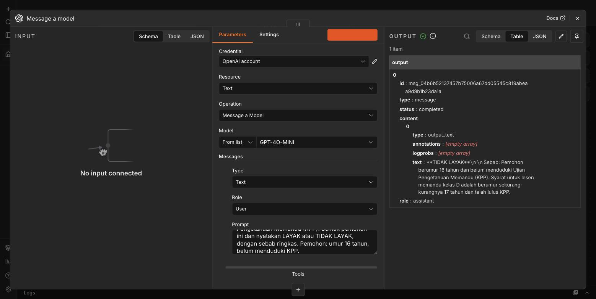

> ⚠️ **Amaran penting:** ini **latihan menaakul**, bukan sistem keputusan rasmi. Keputusan kelayakan sebenar mesti ikut peraturan rasmi & disahkan pegawai — AI hanya **membantu menyemak**, bukan memutuskan. (Rujuk [`../nota/08-governance-keselamatan.md`](../../nota/08-governance-keselamatan.md).)

✅ **Semakan:** Model memberi keputusan **TIDAK LAYAK** dan menyebut **kedua-dua** syarat yang gagal (umur & KPP). Cuba tukar pemohon kepada "umur 18, sudah lulus KPP" — patut jadi LAYAK.

---

### Latihan 14 — Padanan Niat & Hala Tuju (Intent → Routing)

**Objektif:** Kenal pasti **niat sebenar** pertanyaan orang awam dan tentukan **bahagian JPJ** mana yang patut mengendalikannya — satu langkah lebih maju daripada pengelasan (Latihan 7): bukan sekadar label, tetapi **hala tuju + keutamaan** dalam bentuk berstruktur untuk automasi.

1. Tukar **Prompt** kepada:
   ```
   Anda penyusun trafik pertanyaan untuk kaunter JPJ. Baca pertanyaan orang
   awam dan pulangkan JSON SAHAJA dengan kunci:
   niat (apa pengguna mahu buat, 1 frasa), bahagian (SATU sahaja:
   Pelesenan / Pendaftaran / Penguatkuasaan), keutamaan (Tinggi/Sederhana/Rendah).
   Pertanyaan: "Kereta saya kena tahan sebab cukai jalan mati, macam mana nak
   lepaskan dan bayar kompaun?"
   ```
2. **Execute step**.

**Output dijangka:** JSON seperti `{"niat":"lepaskan kenderaan ditahan & bayar kompaun","bahagian":"Penguatkuasaan","keutamaan":"Tinggi"}`.

Cuba **tukar pertanyaan** dan lihat hala tuju berubah:
- *"Nak tukar alamat dalam geran kereta"* → `bahagian: "Pendaftaran"`
- *"Bila boleh perbaharui lesen memandu tamat tempoh?"* → `bahagian: "Pelesenan"`

✅ **Semakan:** Output ialah **JSON sah** dengan ketiga-tiga kunci (`niat`, `bahagian`, `keutamaan`), dan `bahagian` yang dipilih **munasabah** untuk pertanyaan. Inilah asas node **IF/Switch** untuk *auto-route* (lihat Cabaran).

---

### Latihan 15 — Penjana Senarai Semak Dokumen (Checklist)

**Objektif:** Tukar satu **prosedur** JPJ kepada **senarai semak dokumen bernombor** yang kemas — pegawai kaunter boleh terus guna untuk semak pemohon, atau paparkan kepada orang awam sebelum datang.

1. Tukar **Prompt** kepada:
   ```
   Anda pembantu kaunter JPJ. Daripada penerangan prosedur di bawah, hasilkan
   SENARAI SEMAK DOKUMEN bernombor yang perlu dibawa pemohon. Guna Bahasa
   Melayu ringkas, satu item satu baris, tanda [ ] di hadapan setiap item.
   Jangan tambah dokumen yang tidak disebut.

   Prosedur (data latihan contoh, bukan rasmi): Untuk pindah milik kenderaan
   persendirian, penjual dan pembeli perlu hadir dengan kad pengenalan asal,
   borang JPJK3 yang lengkap, geran kenderaan asal, serta bukti insurans dan
   cukai jalan yang sah atas nama pembeli. Kenderaan mesti lulus pemeriksaan
   Puspakom bagi kes tertentu.
   ```
2. **Execute step**.

**Output dijangka:** senarai bernombor dengan kotak `[ ]` — cth. kad pengenalan asal, borang JPJK3, geran asal, insurans, cukai jalan, laporan Puspakom.

✅ **Semakan:** Output ialah **senarai semak bernombor** yang menangkap **setiap dokumen** yang disebut dalam prosedur (tiada yang tertinggal, tiada yang direka), sesuai dicetak atau dipaparkan di kaunter.

---

### Latihan 16 — Penerang Istilah Bahasa Mudah (Plain-language)

**Objektif:** Tulis semula ayat rasmi/perundangan JPJ yang berat kepada **Bahasa Melayu mudah** yang orang awam faham — kurangkan pertanyaan berulang di kaunter kerana notis "tak difahami".

1. Tukar **Prompt** kepada:
   ```
   Tulis semula ayat rasmi berikut kepada Bahasa Melayu mudah yang orang awam
   biasa boleh faham (elak jargon perundangan), maksimum 2 ayat. Kekalkan
   maksud asal — jangan tokok atau kurangkan syarat.

   Ayat asal (petikan gaya Akta Pengangkutan Jalan 1987, contoh):
   "Tiada seseorang pun boleh memandu sesuatu kenderaan motor di atas
   sesuatu jalan melainkan dia adalah pemegang lesen memandu yang sah
   yang dikeluarkan di bawah Akta ini dan lesen tersebut masih berkuat kuasa."
   ```
2. **Execute step**.

**Output dijangka:** ayat ringkas seperti *"Anda tidak boleh memandu di jalan raya melainkan anda memegang lesen memandu yang sah dan masih belum tamat tempoh."*

✅ **Semakan:** Ayat baharu **mengekalkan maksud** asal (mesti ada lesen sah + masih berkuat kuasa) tetapi jauh **lebih mudah difahami** — tanpa istilah perundangan yang berat.

---

> 🔎 **Tip — Sejarah *Executions*:** Setiap kali anda **Execute**, n8n merekod larian dalam tab **Executions**. Klik tab itu untuk melihat **semua larian** (masa, tempoh, berjaya/gagal) — sangat berguna untuk *debug* bila sesuatu tak menjadi.

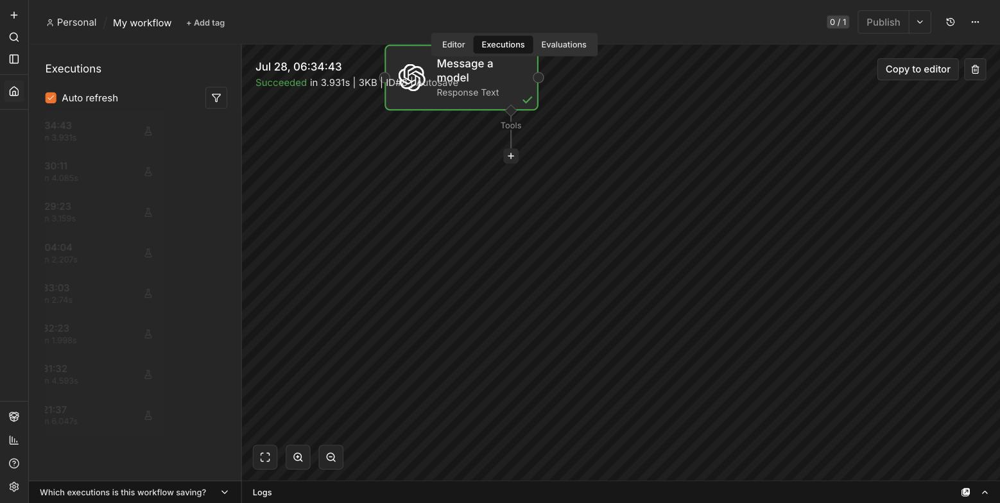

---

> 🎯 **Kesimpulan hari ini:** daripada **satu** corak `Trigger → OpenAI → (Response)`, anda telah bina **12 kes guna JPJ** berbeza — jawab, ringkas, kelas, ekstrak, terjemah, *endpoint*, analisis sentimen, draf balasan, semakan kelayakan, padanan niat/hala tuju, penjana senarai semak, & penerang istilah bahasa mudah. Corak yang sama diperluas kepada **RAG** (Hari 2) dan **ejen berbilang alat** (Hari 3).

---

## Cabaran

Pilih **sekurang-kurangnya satu** untuk cuba selepas Latihan 5 siap:

1. **System prompt anti-halusinasi** — Ubah prompt node OpenAI supaya ia **sentiasa** menolak mereka nombor rasmi: tambah arahan tegas *"Jika soalan meminta kadar bayaran, nombor borang, atau tarikh khusus yang tiada dalam arahan ini, jawab: 'Sila sahkan dengan kaunter JPJ' dan JANGAN nyatakan angka."* Uji dengan soalan yang meminta kadar kompaun — sahkan ia **enggan mereka** nombor.
2. **Balasan berstruktur JSON** — Minta model memulangkan jawapan sebagai JSON dengan medan `{ "jawapan": "...", "keyakinan": "tinggi/rendah", "perlu_sahkan_kaunter": true/false }`. (Petunjuk: nyatakan format JSON yang tepat dalam prompt.) Ini corak berguna untuk Hari 3 (ejen).
3. **Dua bahasa** — Tambah arahan supaya pembantu **mengesan bahasa soalan** dan menjawab dalam bahasa yang sama (BM soalan → BM jawapan; English question → English answer). Uji dengan kedua-dua bahasa.
4. **Bandingkan model** — Jalankan workflow yang sama dengan **dua** model berbeza (cth. `gpt-4o-mini` vs model Ollama tempatan seperti `llama3`). Banding kelajuan, gaya jawapan, dan (jika Ollama) fakta bahawa data **tidak keluar** dari mesin anda. Catat pemerhatian.
5. **Pra-RAG manual dalam n8n** — Tambah satu node **Set/Edit Fields** **sebelum** OpenAI yang menyimpan satu petikan SOP contoh (data latihan) sebagai medan `context`. Ubah prompt supaya menyuntik `{{ $json.context }}` sebagai konteks dan mengarah model jawab **daripada konteks itu sahaja**. Ini **pratonton RAG** — Hari 2 kita gantikan node Set ini dengan **carian vektor sebenar** dalam Qdrant.
6. **Rantai: Kelas → Auto-halakan (2 node)** — Gabungkan Latihan 7/14 dengan penghalaan sebenar. Selepas node OpenAI yang mengeluarkan `bahagian` (Pelesenan/Pendaftaran/Penguatkuasaan), tambah node **IF** (atau **Switch**) yang membaca output itu dan **bercabang** ke laluan berbeza — cth. satu cabang set medan `mesej: "Dihalakan ke kaunter Pelesenan"`, cabang lain ke Pendaftaran. Uji dengan tiga pertanyaan berbeza & sahkan ia sampai ke cabang betul. (Petunjuk: rujuk output node OpenAI dengan Expression seperti `{{ $json.message.content }}` dalam syarat IF.) Inilah asas *auto-triage* pertanyaan JPJ.
7. **Rantai: Ringkas → Terjemah (2 node)** — Sambung **dua** node OpenAI berturut. Node pertama **ringkaskan** pekeliling JPJ panjang (guna prompt Latihan 6). Node kedua ambil ringkasan itu (`{{ $json.message.content }}` dari node sebelumnya) dan **terjemah ke English** (gaya Latihan 9). Hasilnya: notis panjang BM → ringkasan padat → versi English — sedia diedar kepada orang awam dwibahasa dalam satu larian.

> Tiada jawapan "betul" tunggal untuk Cabaran — matlamatnya berlatih menggabungkan konsep. Tunjuk hasil kepada fasilitator sebelum tamat kelas.

---

## Rujukan & Langkah Seterusnya

| Latihan | Rujukan konsep (README) | Rujukan luar |
|---------|-------------------------|--------------|
| Token (Latihan 2) | [SESI 2 — Token & context window](../README.md#sesi-2-1030--100--memahami-large-language-models-llm) | [platform.openai.com/tokenizer](https://platform.openai.com/tokenizer) |
| Prompt engineering (Latihan 2) | [SESI 2 — Asas prompt engineering](../README.md) | [platform.openai.com/docs/guides/prompt-engineering](https://platform.openai.com/docs/guides/prompt-engineering) |
| Carian semantik (Latihan 4) | [SESI 4 — Embeddings](../README.md) | [platform.openai.com/docs/guides/embeddings](https://platform.openai.com/docs/guides/embeddings) · [qdrant.tech](https://qdrant.tech/documentation/) |
| Workflow AI (Latihan 5) | [SESI 5 — Pengenalan n8n](../README.md) | [docs.n8n.io/advanced-ai](https://docs.n8n.io/advanced-ai/) |
| Templat workflow pertama | — | `../templates/workflows/01-first-ai-workflow.json` |

> **Esok (Hari 2):** kita gantikan "pengetahuan umum model" dengan **dokumen JPJ sebenar** — pasang Qdrant, proses & *chunk* dokumen, bina *ingestion* + *retrieval workflow* → **Pembantu Pengetahuan JPJ**. Pastikan credentials OpenAI/Ollama anda masih tersimpan dalam n8n sebelum tamat kelas hari ini.
