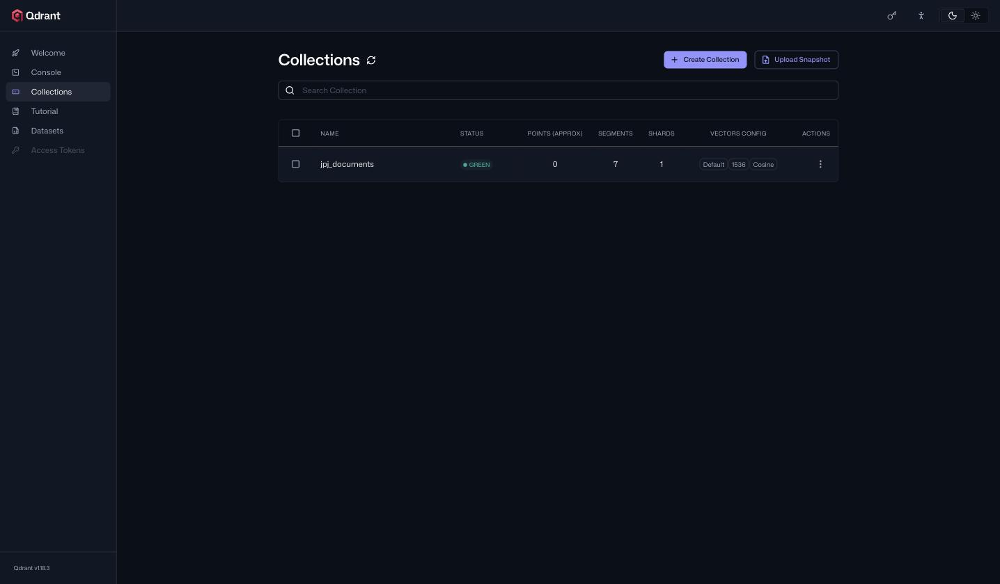
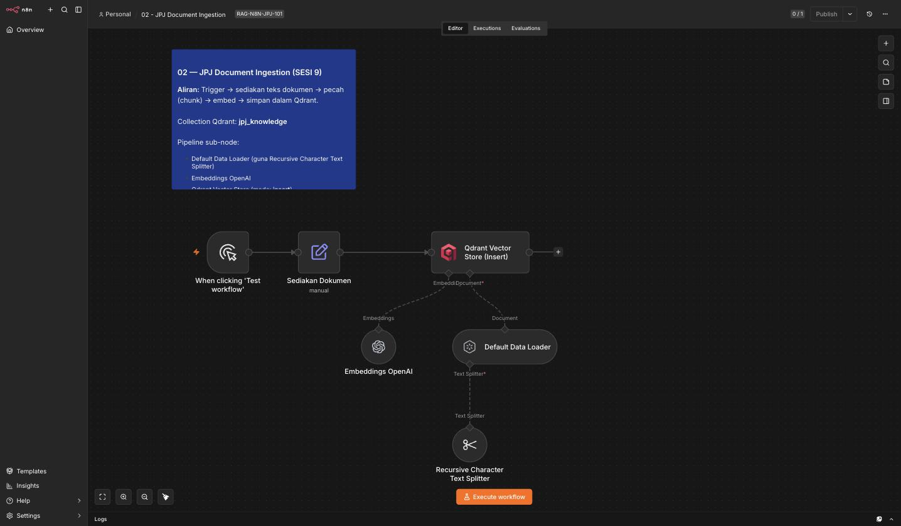
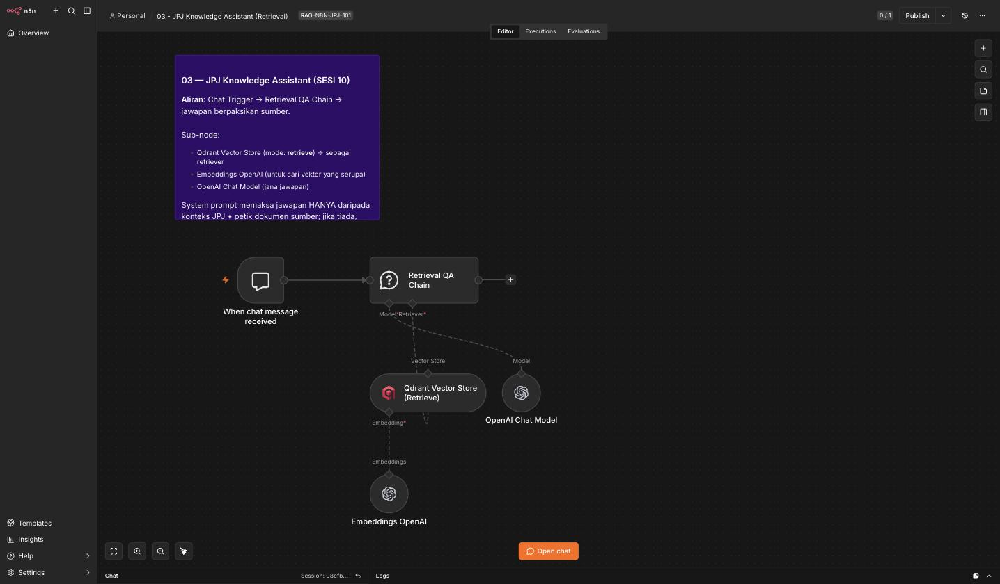

# Lab Hari 2 — Membina Penyelesaian RAG Lengkap

Lab ini mengiringi [`README.md`](../README.md) Hari 2. Ikut latihan **secara berurutan** — setiap latihan bina di atas latihan sebelumnya (tak boleh *retrieval* jika belum *ingestion*, tak boleh *ingestion* jika Qdrant belum hidup). Rujuk templat *workflow* rujukan di [`../../templates/workflows/`](../../templates/workflows/) untuk **banding** selepas cuba sendiri — peta penuh templat→lab: [`templates/workflows/README.md`](../../templates/workflows/README.md) (Hari 2 = `02-ingestion` & `03-retrieval`).

> **Peraturan lab:** Cuba susun *node* & tetapkan nilai **sendiri** dahulu berdasarkan penerangan dalam README, sebelum tengok fail rujukan. RAG paling mudah difahami dengan **membina sendiri** — bukan sekadar import templat siap.

> **Konvensyen:** Penerangan dalam Bahasa Melayu; nama *node*, kunci JSON & nilai tetapan dalam Bahasa Inggeris.

---

## Senarai Semak Persediaan

Sebelum Latihan 0, pastikan semua berikut sudah **✓** (rujuk [`../../nota/05-setup-docker.md`](../../nota/05-setup-docker.md) jika belum):

- [ ] `docker --version` & `docker compose version` berjaya dijalankan
- [ ] Fail [`../../templates/docker-compose.yml`](../../templates/docker-compose.yml) ada & mengandungi servis `qdrant` + `n8n`
- [ ] n8n boleh dibuka di `http://localhost:5678`
- [ ] *Credential* **OpenAI** (kunci API) sudah dimasukkan dalam n8n
- [ ] Dokumen contoh ada di [`../../templates/sample-docs/`](../../templates/sample-docs/)

Jika ada yang belum ✓, selesaikan dahulu sebelum teruskan.

---

## Latihan 0 — Hidupkan Docker Stack & Sahkan Dashboard Qdrant

**Objektif:** Pastikan Qdrant benar-benar berjalan sebelum menyentuh RAG.

> 📸 **Panduan bergambar (screenshots setiap langkah):** [`../../nota/05-setup-docker.md#panduan-bergambar--langkah-demi-langkah-`](../../nota/05-setup-docker.md) — tunjuk output terminal sebenar + skrin n8n & Qdrant yang anda patut lihat.

1. Dari folder yang mengandungi `docker-compose.yml`, jalankan:

   ```bash
   docker compose up -d
   ```

   Bendera `-d` (*detached*) menjalankan kontena di latar belakang. Kali pertama, Docker akan **muat turun imej** Qdrant/n8n — sabar sebentar.

2. Sahkan kontena berjalan:

   ```bash
   docker compose ps
   ```

   Anda patut nampak servis `qdrant` (dan `n8n`) berstatus `running`/`Up`.

3. Buka **dashboard Qdrant** dalam pelayar:

   ```
   http://localhost:6333/dashboard
   ```

   Anda patut nampak antara muka Qdrant. Pada mulanya **tiada collection** — itu normal, kita cipta dalam Latihan 1.

4. (Pilihan) Sahkan Qdrant hidup melalui API:

   ```bash
   curl http://localhost:6333/collections
   ```

   Hasil `{"result":{"collections":[]},"status":"ok", ...}` bermakna Qdrant sihat.

✅ **Semakan:** Dashboard Qdrant terbuka di `http://localhost:6333/dashboard` tanpa ralat, dan `docker compose ps` menunjukkan `qdrant` berstatus `Up`. Jika dashboard tidak terbuka, semak `docker compose logs qdrant` untuk ralat.

---

## Latihan 1 — Cipta Qdrant Collection

**Objektif:** Sediakan *collection* `jpj_documents` dengan dimensi & distance yang **betul** — asas semua kerja seterusnya.

> 🟣 **Baru kenal Qdrant?** Buat dahulu **[Tutorial Hands-On Qdrant](../../nota/12-tutorial-qdrant.md)** — 5 latihan ringkas (collection, point, carian vektor, filter) guna *toy vectors*, tanpa n8n/OpenAI. Selepas itu langkah di bawah jauh lebih jelas.

**Kenapa cipta collection dahulu?** Collection ialah "laci" tempat vektor disimpan. Ia mesti wujud dengan **dimensi = 1536** (padan `text-embedding-3-small`) dan **distance = Cosine** sebelum *ingestion* boleh menulis ke dalamnya. (Nota: *node* Qdrant Vector Store boleh mencipta collection secara automatik, tetapi mencipta manual dahulu menjadikan tetapan **jelas** & mudah nyahpepijat.)

**Cara A — melalui API (`curl`):**

```bash
curl -X PUT http://localhost:6333/collections/jpj_documents \
  -H 'Content-Type: application/json' \
  -d '{
    "vectors": {
      "size": 1536,
      "distance": "Cosine"
    }
  }'
```

Hasil `{"result":true,"status":"ok", ...}` bermakna collection tercipta.

**Cara B — melalui dashboard:** Buka `http://localhost:6333/dashboard` → **Collections** → **Create** → nama `jpj_documents`, `size: 1536`, `distance: Cosine`.

Sahkan:

```bash
curl http://localhost:6333/collections/jpj_documents
```

Anda patut nampak `"status":"green"`, `"vectors_count":0` (masih kosong — betul, belum ingest).

> **Perangkap dimensi:** Jika anda guna model *embedding* lain, dimensi berbeza — cth. `text-embedding-3-large` = **3072**. Dimensi collection **mesti** sepadan model, jika tidak Qdrant tolak data dengan ralat *"Wrong input: Vector dimension error"*.

Dalam **dashboard Qdrant** (`localhost:6333/dashboard` → **Collections**), collection `jpj_documents` kelihatan **GREEN** dengan config **1536 · Cosine** dan **0 points** (belum ingest) — skrin sebenar:



✅ **Semakan:** `curl http://localhost:6333/collections/jpj_documents` memulangkan `status: green`, `config` menunjukkan `size: 1536` & `distance: Cosine`, dan `vectors_count: 0`. Collection kini sedia diisi.

---

## Latihan 2 — Bina *Ingestion Workflow* & Indeks Dokumen JPJ

**Objektif:** Bina *workflow* yang membaca dokumen contoh, memotongnya kepada *chunk*, menjananya jadi vektor, dan menyimpannya ke Qdrant. Rujukan: `../../templates/workflows/02-ingestion-workflow.json`.

### 2.1 — Workflow baharu & trigger

1. Dalam n8n, cipta **New Workflow**, namakan `02 - JPJ Ingestion`.
2. Tambah **Manual Trigger** (untuk uji jalankan tangan). Untuk sumber dokumen, tambah node membaca fail contoh — cth. **Read/Write Files from Disk** (mod *Read*) menuding ke folder `sample-docs/`, atau tampal teks contoh terus untuk ujian pertama.

### 2.2 — Tambah Qdrant Vector Store (root, mod Insert)

1. Tambah node **Qdrant Vector Store**.
2. Set **Operation Mode: Insert Documents**.
3. **Qdrant Collection:** `jpj_documents`.
4. **Credential:** cipta *credential* Qdrant baharu. **Penting:** dari dalam kontena n8n, URL Qdrant ialah `http://qdrant:6333` (nama servis Docker) — **bukan** `http://localhost:6333`. (Jika n8n berjalan di luar Docker, barulah `localhost`.)

### 2.3 — Sambung sub-node: Data Loader + Text Splitter

1. Di bawah Qdrant Vector Store, sambung **Default Data Loader** (pada input *Document*).
2. Dalam Data Loader, tambah **metadata** untuk setiap dokumen:
   - `source` → nama fail (cth. `sop-lesen.pdf`)
   - `doc_type` → `lesen` / `pendaftaran` / `saman` / `sop` / `faq`
   - `title` → tajuk mesra pengguna
3. Sambung **Recursive Character Text Splitter** ke Data Loader. Tetapkan:
   - **Chunk Size:** `1000`
   - **Chunk Overlap:** `200`

### 2.4 — Sambung sub-node: Embeddings OpenAI

1. Sambung **Embeddings OpenAI** ke input *Embedding* pada Qdrant Vector Store.
2. **Model:** `text-embedding-3-small` (1536 dimensi — sepadan collection).
3. **Credential:** pilih *credential* OpenAI anda.

### 2.5 — Jalankan & indeks

1. Klik **Test workflow** / **Execute**.
2. Perhatikan setiap node bertukar hijau. Jika ada node merah, klik untuk baca ralat (selalunya *credential* atau nama collection).

> 📸 **Rujukan visual:** Anda boleh **import** templat siap `../../templates/workflows/02-ingestion-workflow.json` (menu ⋯ → *Import from File*) untuk membanding. Beginilah rupa *ingestion workflow* siap pada kanvas — perhatikan corak **root + sub-node**: **Qdrant Vector Store (Insert)** dengan **Embeddings OpenAI**, **Default Data Loader**, dan **Recursive Character Text Splitter** bersambung di bawahnya:



✅ **Semakan:** Selepas jalankan, buka `http://localhost:6333/dashboard` → collection `jpj_documents` → bilangan **points > 0** (cth. beberapa puluh, bergantung bilangan *chunk*). Atau `curl http://localhost:6333/collections/jpj_documents` menunjukkan `points_count` > 0. **Jika masih 0 — ingestion gagal**; semak node membaca fail & *credential* Qdrant (`http://qdrant:6333`).

---

## Latihan 3 — Bina *Retrieval Workflow* & Tanya Soalan JPJ

**Objektif:** Bina **Pembantu Pengetahuan JPJ** yang menjawab soalan daripada dokumen yang baru diindeks. Rujukan: `../../templates/workflows/03-retrieval-workflow.json`.

### 3.1 — Workflow baharu & trigger

1. Cipta **New Workflow**, namakan `03 - JPJ Retrieval`.
2. Tambah **Chat Trigger** (antara muka sembang terbina) — atau **Manual Trigger** dengan satu medan `question` untuk ujian ringkas.

### 3.2 — Tambah Question and Answer Chain (root)

1. Tambah node **Question and Answer Chain**.
2. Jika guna Manual Trigger, petakan input soalan ke medan *Query*/*Question* chain (cth. `{{ $json.question }}`).

### 3.3 — Sambung Qdrant Vector Store (mod Retrieve)

1. Sambung **Qdrant Vector Store** ke input *Retriever* pada Q&A Chain.
2. **Operation Mode: Retrieve Documents (As Vector Store for Chain).**
3. **Qdrant Collection:** `jpj_documents` (**sama** seperti ingestion).
4. **Top K:** `4`.
5. **Credential:** Qdrant (`http://qdrant:6333`) — sama seperti Latihan 2.

### 3.4 — Sambung Embeddings OpenAI (mesti SAMA model)

1. Sambung **Embeddings OpenAI** ke Qdrant Vector Store (retrieve).
2. **Model:** `text-embedding-3-small` — **WAJIB sama** dengan yang digunakan semasa ingestion (Latihan 2.4). Model berbeza = ruang vektor tak serasi = carian mengarut.

### 3.5 — Sambung OpenAI Chat Model

1. Sambung **OpenAI Chat Model** ke input *Model* pada Q&A Chain.
2. **Model:** `gpt-4o-mini` (atau setara).
3. (Pilihan tetapi disyorkan) Dalam tetapan *prompt* Q&A Chain, arahkan model **jawab hanya dari konteks**, **akui jika tidak pasti**, dan **sebut nama dokumen sumber**.

### 3.6 — Tanya soalan

Jalankan *workflow* dan tanya (satu demi satu):

- *"Berapa lama tempoh sah LMM boleh dibaharui?"*
- *"Apa dokumen diperlukan untuk pindah milik kenderaan?"*
- *"Bagaimana cara semak saman/kompaun tertunggak?"*
- *"Apa syarat kelayakan untuk memohon GDL?"*
- *"Apa prosedur pendaftaran kenderaan baharu?"*

> 📸 **Rujukan visual:** Beginilah rupa *retrieval workflow* siap (import `../../templates/workflows/03-retrieval-workflow.json`) — **Chat Trigger → Retrieval QA Chain**, dengan **Qdrant Vector Store (Retrieve)**, **Embeddings OpenAI** & **OpenAI Chat Model** sebagai sub-node:



✅ **Semakan:** Pembantu memulangkan jawapan yang **munasabah & konsisten** dengan dokumen contoh untuk setiap soalan di atas. Jika jawapan kosong / "tiada maklumat" untuk **semua** soalan — kemungkinan collection kosong (ulang Latihan 2) atau model embedding tak sepadan (semak Latihan 3.4).

---

## Latihan 4 — Sahkan Jawapan Berpaksikan Sumber (Grounded)

**Objektif:** Buktikan pembantu benar-benar **berpaksikan dokumen**, bukan mereka jawapan (halusinasi).

1. **Uji petikan sumber:** Tanya soalan yang jawapannya **ada** dalam dokumen (cth. tempoh pembaharuan LMM). Semak jawapan **menyebut sumber** (nama dokumen). Silang semak jawapan dengan kandungan sebenar fail dalam [`../../templates/sample-docs/`](../../templates/sample-docs/) — ia patut **sepadan**.

2. **Uji soalan luar skop:** Tanya sesuatu yang **tiada** dalam dokumen, cth.:

   > *"Berapa harga minyak petrol RON95 hari ini?"*

   Pembantu **sepatutnya** menjawab lebih kurang *"Maaf, maklumat ini tiada dalam dokumen JPJ yang saya rujuk"* — **bukan** mereka satu harga. Jika ia mereka jawapan, kuatkan arahan *prompt* dalam Q&A Chain (*"jawab HANYA dari konteks; jika tiada, katakan tidak pasti"*).

3. **Uji ketekalan (*consistency*):** Tanya soalan sama **dua kali**. Jawapan patut serupa (berpaksikan *chunk* sama), bukan berubah-ubah drastik.

4. (Pilihan) Buka dashboard Qdrant, guna ciri **search** untuk melihat *chunk* mana yang paling serupa dengan soalan anda — sahkan ia memang *chunk* yang relevan.

✅ **Semakan:** (a) Soalan dalam-skop dijawab dengan **petikan sumber yang boleh disahkan** terhadap fail `sample-docs/`; (b) soalan luar-skop **ditolak dengan jujur** ("tidak pasti / tiada dalam dokumen"), bukan direka. Kedua-dua ini bukti pembantu anda **grounded** — teras RAG.

---

## Latihan 5 — Metadata Filtering (Tapis mengikut `doc_type`)

**Objektif:** Buat *retrieval workflow* mencari **hanya** dalam subset dokumen tertentu (cth. dokumen lesen sahaja) dengan **metadata filter** Qdrant — supaya jawapan lebih fokus dan tidak "tercemar" oleh *chunk* daripada jenis dokumen lain. 📖 Bacaan lanjut: **Bab 6** buku rujukan ([`../../nota/00-rujukan-buku.md`](../../nota/00-rujukan-buku.md)).

**Kenapa perlu?** Semasa ingestion (Latihan 2.3) anda telah tag setiap dokumen dengan `doc_type` (`lesen` / `pendaftaran` / `saman` / `sop` / `faq`). Metadata ini boleh dipakai untuk **mengecilkan ruang carian** — jika pegawai bertanya soalan lesen, tak perlu Qdrant menoleh *chunk* saman langsung.

1. Buka *retrieval workflow* Latihan 3, pilih node **Qdrant Vector Store** (mod *Retrieve*).
2. Dalam tetapan node, buka **Options → Metadata Filter** (atau medan **Search Filter** JSON, bergantung versi node). Masukkan penapis Qdrant:

   ```json
   {
     "must": [
       { "key": "metadata.doc_type", "match": { "value": "lesen" } }
     ]
   }
   ```

   > **Nota kunci:** dalam Qdrant, metadata yang ditulis oleh Data Loader n8n biasanya bersarang di bawah `metadata.` (cth. `metadata.doc_type`). Sahkan nama sebenar dengan buka satu *point* dalam dashboard Qdrant (`localhost:6333/dashboard` → collection → **Points**) dan lihat struktur *payload*.

3. Fahami **`must` vs `should`** (teras filter Qdrant):
   - **`must`** = semua syarat **WAJIB** dipenuhi (logik **AND**) — guna ini untuk `doc_type = "lesen"` yang ketat.
   - **`should`** = sekurang-kurangnya satu syarat dipadankan (logik **OR**) — cth. `doc_type` ialah `lesen` **atau** `faq`:

     ```json
     {
       "should": [
         { "key": "metadata.doc_type", "match": { "value": "lesen" } },
         { "key": "metadata.doc_type", "match": { "value": "faq" } }
       ]
     }
     ```
   - (`must_not` pula = **kecualikan** — cth. jangan sekali-kali pulangkan *chunk* `doc_type = "sop"` yang bersifat dalaman.)

4. Jalankan *workflow* **dua kali** dengan soalan yang sama (cth. *"Berapa lama tempoh sah LMM boleh dibaharui?"*):
   - **(a)** dengan penapis `doc_type = "lesen"` aktif;
   - **(b)** tanpa penapis (kosongkan medan filter).

   Bandingkan: adakah jawapan **(a)** lebih tepat / kurang bercampur? Buka Qdrant dashboard **search** untuk lihat *chunk* mana dipulangkan dalam setiap kes.

5. Uji **kes silang**: dengan penapis `doc_type = "lesen"` **masih aktif**, tanya soalan **saman** (cth. *"Bagaimana semak kompaun tertunggak?"*). Pembantu patut **gagal jumpa** jawapan — kerana *chunk* saman ditapis keluar. Ini bukti penapis benar-benar mengehadkan skop.

✅ **Semakan:** Dengan penapis `must: doc_type = "lesen"`, carian **hanya** memulangkan *chunk* daripada dokumen lesen (sahkan di Qdrant search), soalan lesen dijawab normal, dan soalan saman **tidak** dijawab (di luar subset). Anda boleh terangkan beza `must` (AND) vs `should` (OR).

---

## Latihan 6 — Eksperimen Saiz Chunk (Precision vs Context)

**Objektif:** Alami sendiri **tradeoff saiz chunk** — *chunk* kecil = padanan tepat tetapi konteks terpotong; *chunk* besar = konteks kaya tetapi padanan kabur & kos tinggi. 📖 **Bab 6** (*select document length*).

**Idea:** Ingest dokumen **yang sama** dengan tiga saiz *chunk* berbeza ke dalam **tiga collection berasingan**, kemudian tanya **soalan yang sama** pada ketiga-tiganya dan bandingkan.

1. Cipta tiga collection baharu (dimensi & distance sama seperti Latihan 1 — `1536` · `Cosine`):

   ```bash
   for name in jpj_documents_500 jpj_documents_1000 jpj_documents_2000; do
     curl -X PUT http://localhost:6333/collections/$name \
       -H 'Content-Type: application/json' \
       -d '{ "vectors": { "size": 1536, "distance": "Cosine" } }'
   done
   ```

2. Guna semula *ingestion workflow* (Latihan 2). Jalankan **tiga kali**, setiap kali tukar **dua** tetapan sahaja:

   | Larian | Qdrant Collection | Chunk Size | Chunk Overlap |
   |--------|-------------------|-----------:|--------------:|
   | 1 | `jpj_documents_500` | `500` | `200` |
   | 2 | `jpj_documents_1000` | `1000` | `200` |
   | 3 | `jpj_documents_2000` | `2000` | `200` |

   > **Malar (*controlled variable*):** kekalkan **dokumen sama**, **model embedding sama** (`text-embedding-3-small`), dan overlap `200` — hanya **Chunk Size** yang berubah, supaya perbandingan adil.

3. Perhatikan bilangan *points* setiap collection (`curl http://localhost:6333/collections/jpj_documents_500` dsb.). *Chunk* `500` menghasilkan **lebih banyak** *points* daripada `2000` — logik: potongan lebih kecil = lebih banyak keping.

4. Dalam *retrieval workflow* (Latihan 3), tukar **Qdrant Collection** kepada setiap collection secara bergilir dan tanya **soalan spesifik yang sama**, cth.:

   > *"Berapa denda maksimum bagi kesalahan memandu tanpa lesen di bawah Akta Pengangkutan Jalan 1987?"*

5. Bandingkan (catat dalam jadual anda sendiri):
   - **Chunk 500** — padanan tepat pada fakta spesifik, tetapi kadang jawapan **terpotong** (konteks sekeliling hilang).
   - **Chunk 1000** — biasanya **imbangan terbaik** untuk dokumen JPJ (prosedur berperenggan).
   - **Chunk 2000** — konteks penuh, tetapi *chunk* besar boleh **cairkan** padanan (skor similarity turun) & guna lebih banyak *token* dalam *prompt*.

✅ **Semakan:** Anda ada tiga collection (`_500` / `_1000` / `_2000`) dengan `points_count` berbeza, dan satu jadual perbandingan jawapan untuk **soalan yang sama**. Anda boleh terangkan tradeoff **precision (chunk kecil) vs context (chunk besar)** dan mencadangkan saiz sesuai untuk dokumen JPJ.

---

## Latihan 7 — Uji Soalan Luar Skop (Grounded Refusal)

**Objektif:** Buktikan pembantu **menolak dengan jujur** apabila jawapan **tiada** dalam dokumen JPJ — bukan mereka-reka (halusinasi). Ini ujian teras anti-halusinasi RAG. 📖 **Bab 6** (generator berpaksikan konteks).

> Latihan 4.2 telah menyentuh ini secara ringkas; di sini anda uji **secara sistematik** dengan beberapa soalan luar skop dan mengukuhkan *prompt* jika perlu.

1. Pastikan *retrieval workflow* (Latihan 3) berjalan dan collection `jpj_documents` berisi.
2. Tanya satu demi satu soalan yang **jelas di luar** kandungan dokumen JPJ contoh:

   - *"Berapa harga minyak petrol RON95 hari ini?"*
   - *"Apakah ramalan cuaca di Putrajaya esok?"*
   - *"Siapakah pemenang Piala Malaysia tahun lepas?"*
   - *"Berapa kadar faedah pinjaman perumahan bank sekarang?"*

3. Untuk **setiap** soalan, pembantu **sepatutnya** menjawab lebih kurang:

   > *"Maaf, maklumat ini tiada dalam dokumen JPJ yang saya rujuk."*

   dan **bukan** memberikan nombor atau fakta yang direka.

4. Jika pembantu **tetap mereka jawapan**, kukuhkan arahan sistem dalam **Question and Answer Chain** — cth.:

   > *"Jawab HANYA berdasarkan konteks dokumen yang diberi. Jika jawapan tiada dalam konteks, katakan dengan jelas: 'Maklumat ini tiada dalam dokumen JPJ yang saya rujuk.' JANGAN sekali-kali mereka fakta, nombor, atau tarikh yang tiada dalam konteks."*

   Jalankan semula langkah 2 dan sahkan tingkah laku bertambah baik.

5. **Ujian kawalan (*positive control*):** selang-selikan dengan **satu** soalan dalam skop (cth. *"Apa dokumen diperlukan untuk pindah milik kenderaan?"*) untuk pastikan pembantu **masih menjawab** soalan sah — anti-halusinasi tidak sepatutnya menjadikannya **enggan menjawab semua benda**.

✅ **Semakan:** Semua **empat** soalan luar skop ditolak dengan jujur (*"tiada dalam dokumen"*), manakala soalan dalam skop **tetap dijawab** betul. Ini membuktikan pembantu **grounded** — teras nilai RAG untuk dokumen rasmi JPJ.

---

## Latihan 8 — Kemas Kini Dokumen & Indeks Semula

**Objektif:** Simulasi **pekeliling dikemas kini** — edit satu dokumen contoh, ingest semula, dan sahkan kandungan **baharu** boleh dicari. Anda juga akan faham isu **data basi (*stale*)** & **duplikasi**. 📖 **Bab 6** (RAG implementations / pengurusan indeks).

1. Buka satu fail dalam [`../../templates/sample-docs/`](../../templates/sample-docs/) (cth. FAQ lesen). **Salin** dahulu supaya asal tak hilang, kemudian tambah satu **perenggan baharu yang mudah dicari**, cth.:

   > *"Mulai 1 Januari 2026, tempoh sah Lesen Memandu Malaysia (LMM) maksimum yang boleh dibaharui ialah 10 tahun sekali gus bagi pemohon berumur bawah 55 tahun."*

   (Ini **data sintetik untuk latihan** — bukan pekeliling rasmi JPJ.)

2. **Sebelum** ingest semula, tanya pembantu (Latihan 3): *"Berapa tempoh maksimum LMM boleh dibaharui sekali gus?"* — ia **belum tahu** fakta 10 tahun ini (belum diindeks). Catat jawapan lama.

3. Jalankan semula *ingestion workflow* (Latihan 2) untuk memasukkan versi dokumen yang dikemas kini ke collection `jpj_documents`.

4. Tanya **soalan yang sama** sekali lagi. Pembantu kini **sepatutnya** memulangkan fakta baharu (10 tahun) — bukti kandungan terkini boleh dicari.

5. **Bincang isu indeks (penting untuk pengeluaran):**
   - **Duplikasi:** jika anda hanya *Insert* semula tanpa buang *chunk* lama, dokumen versi lama **masih** dalam collection → boleh ada **dua** versi bercanggah dipulangkan. Dalam pengeluaran, guna **ID stabil** setiap *chunk* (cth. `source` + nombor *chunk*) untuk *upsert*/gantikan, atau **padam** dahulu semua *point* dengan `metadata.source = <fail>` sebelum ingest semula.
   - Contoh padam mengikut sumber (Qdrant API):

     ```bash
     curl -X POST http://localhost:6333/collections/jpj_documents/points/delete \
       -H 'Content-Type: application/json' \
       -d '{ "filter": { "must": [ { "key": "metadata.source", "match": { "value": "faq-lesen.pdf" } } ] } }'
     ```
   - **Data basi (*stale*):** dokumen yang **dimansuhkan** perlu **dibuang** dari indeks, jika tidak pembantu boleh memetik pekeliling lapuk — bahaya untuk konteks JPJ.

✅ **Semakan:** Selepas ingest semula, pembantu memulangkan **fakta baharu** yang tak wujud sebelum ini, dan anda boleh terangkan kenapa *upsert* / padam-ikut-`source` diperlukan supaya indeks tak mengumpul versi bercanggah.

---

## Latihan 9 — Laras Top-K (Ketepatan vs Bising vs Kos)

**Objektif:** Fahami kesan **Top K** (bilangan *chunk* dipulangkan) terhadap **kualiti jawapan**, **saiz prompt (token/kos)**, dan **bising (*noise*)** — dan cari nilai *default* yang munasabah. 📖 **Bab 6** (semantic retrieval).

**Latar:** Top K ialah berapa banyak *chunk* paling serupa yang Qdrant pulangkan untuk dimasukkan ke dalam *prompt* LLM. Terlalu **rendah** = terlepas konteks; terlalu **tinggi** = *chunk* tak relevan (bising) + *prompt* besar (mahal & lambat).

1. Dalam *retrieval workflow* (Latihan 3), pilih node **Qdrant Vector Store** (retrieve). Cari medan **Top K**.
2. Pilih **satu soalan tetap** yang jawapannya merentas beberapa perenggan, cth.:

   > *"Apakah langkah-langkah dan dokumen diperlukan untuk pindah milik kenderaan?"*

3. Jalankan **tiga kali**, tukar **Top K** sahaja setiap kali:

   | Larian | Top K | Perhatikan |
   |--------|------:|------------|
   | 1 | `2` | Cukup konteks? Ada langkah tertinggal? |
   | 2 | `4` | Imbangan? |
   | 3 | `10` | Ada *chunk* tak relevan masuk? Jawapan jadi berjela/bising? |

4. Untuk setiap larian, perhatikan (buka *output* node Qdrant untuk lihat *chunk* dipulangkan):
   - **Kelengkapan jawapan** — Top K `2` mungkin terlepas satu dokumen diperlukan; `4` biasanya cukup.
   - **Bising** — Top K `10` mungkin seret masuk *chunk* daripada `doc_type` lain yang kurang relevan.
   - **Saiz prompt / kos** — lebih banyak *chunk* = lebih banyak *token* dihantar ke LLM = **lebih mahal & lambat**. Anggarkan: 10 *chunk* × ~1000 aksara ≈ prompt jauh lebih besar berbanding 2 *chunk*.

5. **Cadangkan default:** untuk dokumen prosedur JPJ, **Top K = 4** biasanya imbangan baik (cukup konteks, bising minimum, kos munasabah). Gabungkan dengan **metadata filter** (Latihan 5) untuk kekalkan Top K rendah **tanpa** terlepas konteks.

✅ **Semakan:** Anda ada perbandingan jawapan pada Top K `2` / `4` / `10` untuk soalan yang sama, boleh tunjuk bila jawapan **terlepas konteks** (K terlalu rendah) vs **jadi bising/mahal** (K terlalu tinggi), dan mencadangkan *default* berpatutan untuk dokumen JPJ.

---

## Cabaran

Pilih **sekurang-kurangnya satu** untuk cuba selepas Latihan 9 siap:

1. **Metadata filter mengikut jenis dokumen** — Tambah penapis pada Qdrant Vector Store (retrieve) supaya carian **hanya** merangkumi `doc_type = 'saman'` apabila pengguna bertanya tentang kompaun. Bandingkan kualiti jawapan dengan & tanpa penapis. (Ini pratonton *metadata filtering* SESI 13, Hari 3.)

2. **Eksperimen chunk size** — Cipta collection kedua (cth. `jpj_documents_small`), ingest semula dokumen **sama** tetapi dengan `chunk size = 400`, `overlap = 80`. Tanya soalan yang sama pada kedua-dua collection dan bandingkan mana beri jawapan lebih tepat. Catat pemerhatian anda — ini asas pengoptimuman SESI 14.

3. **Naikkan Top K** — Ubah `Top K` dari 4 kepada 8, kemudian 2. Perhatikan kesan pada jawapan: terlalu tinggi (bising/mahal) vs terlalu rendah (terlepas konteks). Cari nilai terbaik untuk dokumen JPJ anda.

4. **Kuatkan prompt anti-halusinasi** — Tulis semula arahan sistem Q&A Chain supaya pembantu **sentiasa** menyenaraikan sumber dalam format `[Sumber: nama-fail]` di hujung setiap jawapan, dan **menolak** menjawab jika keyakinan rendah. Uji semula soalan luar-skop Latihan 4.

5. **Antara muka sembang** — Jika anda guna Manual Trigger, tukar kepada **Chat Trigger** supaya pembantu boleh disoal melalui tetingkap sembang n8n yang kemas — lebih dekat dengan pengalaman pegawai kaunter sebenar.

6. **Pratonton hybrid search (BM25 untuk kod tepat)** — Carian *semantic* (vektor) hebat untuk makna, tetapi **lemah** untuk padanan tepat seperti **nombor borang** (cth. `JPJ K3`), **nombor akta/seksyen** (cth. *Seksyen 26 Akta 333*), atau **kod kompaun**. Bina *test*: tanya pembantu semasa ini *"Apakah borang JPJ K3 digunakan untuk?"* dan perhati jika carian vektor terlepas. Bincang bagaimana **BM25 / lexical retrieval** (padanan perkataan tepat) boleh **digabung** dengan carian vektor menjadi **hybrid search** supaya kod & nombor tepat tak terlepas. (Ini pratonton penuh SESI 13, Hari 3 — 📖 **Bab 6**: TF-IDF, BM25, inverted index, hybrid approach.)

7. **Konsep re-ranker** — Ambil Top K yang **lebih besar** (cth. `20`) daripada Qdrant sebagai *candidate*, kemudian **susun semula (*re-rank*)** dan simpan hanya **4 teratas** yang benar-benar paling relevan sebelum hantar ke LLM. Lakar (di atas kertas atau sebagai nota *workflow*) di mana node "re-rank" duduk antara **Qdrant retrieve** dan **Q&A Chain**, dan terangkan kenapa *cross-encoder re-ranker* lebih tepat menilai relevan berbanding skor cosine sahaja. Bandingkan idea ini dengan Latihan 9 (Top-K mentah). (📖 **Bab 6** — re-ranking; SESI 13.)

8. **Skema metadata per-bahagian (*division*)** — Reka satu **skema metadata** lebih kaya untuk dokumen JPJ dan tambah semasa ingestion (Data Loader), cth.:

   ```json
   {
     "doc_type": "sop",
     "division": "Bahagian Pelesenan",
     "negeri": "Selangor",
     "effective_date": "2026-01-01",
     "classification": "dalaman",
     "source": "sop-lesen.pdf"
   }
   ```

   Kemudian bina *retrieval* yang menapis mengikut **`division`** (cth. hanya dokumen *Bahagian Pendaftaran Kenderaan*) atau mengecualikan `classification = "dalaman"` untuk pengguna awam (`must_not`). Ini mensimulasi **kawalan akses berasaskan metadata** — penting untuk tadbir urus data JPJ (📖 **Bab 6** metadata; kaitkan dengan governance SESI 15 & [`../../nota/08-governance-keselamatan.md`](../../nota/08-governance-keselamatan.md)).

> Tiada jawapan "betul" tunggal untuk Cabaran — matlamatnya berlatih melaras RAG. Tunjukkan hasil (terutama perbandingan chunk size / Top K, dan sebarang eksperimen hybrid / re-rank) kepada fasilitator sebelum tamat kelas.

---

## Rujukan Fail

| Fail anda (lab) | Fail rujukan (templat) |
|------------------|------------------------|
| Ingestion Workflow (Latihan 2) | `../../templates/workflows/02-ingestion-workflow.json` |
| Retrieval Workflow (Latihan 3) | `../../templates/workflows/03-retrieval-workflow.json` |
| Docker stack (Latihan 0) | [`../../templates/docker-compose.yml`](../../templates/docker-compose.yml) |
| Dokumen JPJ contoh (Latihan 2 & 4) | [`../../templates/sample-docs/`](../../templates/sample-docs/) |
| Konsep RAG & embeddings | [`../../nota/03-apa-itu-rag.md`](../../nota/03-apa-itu-rag.md) · [`../../nota/04-embeddings-vector-db.md`](../../nota/04-embeddings-vector-db.md) |

> ⚠️ **Penafian:** Dokumen dalam `sample-docs/` ialah **contoh sintetik untuk latihan sahaja** — bukan pekeliling/SOP rasmi JPJ. Gantikan dengan dokumen rasmi yang sah untuk penggunaan sebenar.
