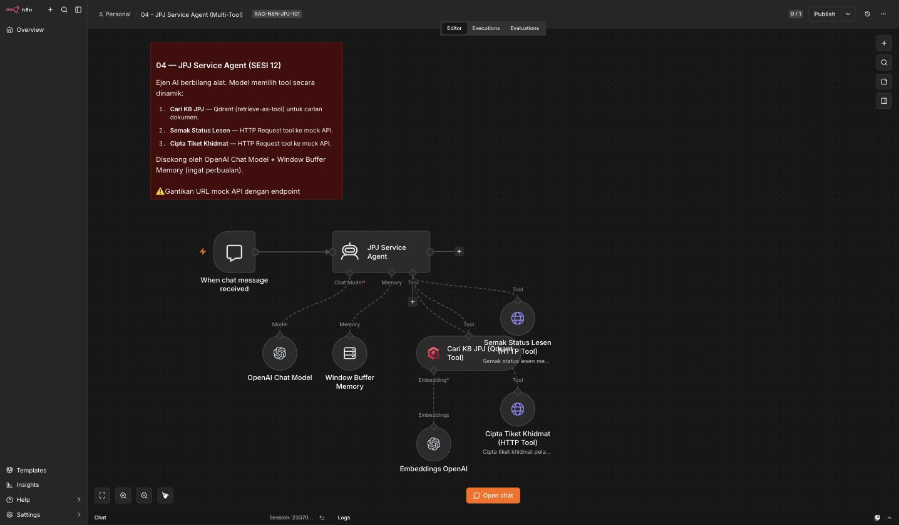

# Lab Hari 3 — AI Agents, Penilaian & Deployment

Lab ini mengiringi [`README.md`](../README.md) Hari 3. Ikut latihan **secara berurutan** — setiap latihan membina di atas yang sebelumnya, sehingga menjadi **Ejen Perkhidmatan JPJ** berbilang alat yang lengkap. Rujuk *workflow* siap `../../templates/workflows/04-agent-workflow.json` untuk **membanding** hasil anda **selepas** mencuba sendiri — peta penuh templat→lab: [`templates/workflows/README.md`](../../templates/workflows/README.md).

> **Peraturan lab:** Bina *workflow* **sendiri** dahulu berdasarkan penerangan sebelum import fail rujukan. Belajar n8n paling berkesan dengan **menyusun *node* sendiri**, bukan import terus.

> **Ingat sifat ejen:** Ejen menggunakan LLM untuk membuat keputusan, jadi ia **tidak selalu berkelakuan sama** untuk soalan yang sama. Kalau ejen pilih alat berlainan daripada rakan anda, itu **normal** — yang penting jawapan akhir tepat & berpaksikan sumber.

---

## Senarai Semak Persediaan (Setup Checklist)

Sebelum Latihan 1, pastikan semua berikut **✓** (rujuk [Hari 2](../../hari-2/) & [`../../nota/05-setup-docker.md`](../../nota/05-setup-docker.md) jika belum):

- [ ] n8n berjalan (Docker) dan boleh dibuka dalam pelayar
- [ ] *Credentials* **OpenAI** *(atau)* **Ollama** sudah dikonfigur dan diuji
- [ ] *Credentials* **Qdrant** sudah dikonfigur
- [ ] **Qdrant collection** dari Hari 2 wujud dan **berisi** dokumen JPJ ter-*embed* (bukan kosong)
- [ ] Anda tahu **nama collection** Qdrant anda (cth. `jpj_docs`)
- [ ] *Retrieval workflow* Hari 2 masih boleh dijalankan

> Kalau *collection* kosong, jalankan semula *ingestion workflow* Hari 2 dahulu — Latihan 2 dan seterusnya **bergantung** padanya.

---

## Latihan 1 — Ejen Pertama (Satu Tool)

**Objektif:** Saksikan gelung *tool calling* (**Select → Execute → Generate**) secara nyata dengan ejen paling ringkas — satu alat sahaja.

1. Cipta *workflow* baharu, namakan `Lab3 - JPJ Agent`.
2. Tambah node **Chat Trigger** (`When chat message received`) sebagai permulaan — ini beri anda tetingkap sembang untuk menguji.
3. Tambah node **AI Agent**. Sambungkan `Chat Trigger → AI Agent`. Biarkan jenis *Tools Agent* (lalai).
4. Pada AI Agent, klik penyambung **Chat Model** dan tambah **OpenAI Chat Model** (cth. model `gpt-4o-mini`) — atau **Ollama Chat Model** (cth. `llama3.1`, yang menyokong *tools*). Pilih *credential* anda.
5. Klik penyambung **Memory** → tambah **Simple Memory** (biar tetapan lalai).
6. Klik penyambung **Tool** → tambah **Calculator** Tool.
7. Buka **Chat** dan tanya: `Kalau kompaun asal RM300 dan diberi diskaun 50%, berapa perlu dibayar?`
8. Buka paparan **execution** (klik pelaksanaan terakhir) dan periksa langkah ejen.

**Apa yang anda patut nampak:** Jawapan `RM150`. Dalam *execution*, AI Agent **memanggil Calculator** dengan sesuatu seperti `300 * 0.5`, menerima `150`, kemudian menyusun ayat jawapan Bahasa Melayu. Anda baru menyaksikan **Select Tool → Execute Tool → Generate Answer**.

> Cuba juga soalan yang **tidak** perlukan kalkulator, cth. `Selamat pagi, awak siapa?` — perhatikan ejen jawab **terus tanpa** memanggil alat. Itu bukti ejen **memilih**, bukan sentiasa guna alat.

✅ **Semakan:** Ejen memulangkan `RM150`, dan dalam *execution* anda nampak panggilan ke Calculator Tool. Untuk soalan bukan-matematik, ejen menjawab tanpa memanggil alat.

---

## Latihan 2 — Tambah Tool "Search Knowledge Base" (Qdrant)

**Objektif:** Jadikan **Qdrant collection** Hari 2 sebagai **alat carian** yang ejen boleh panggil.

1. Pada AI Agent yang sama, klik penyambung **Tool** → tambah **Qdrant Vector Store** dalam mod **"Retrieve Documents (As Tool for AI Agent)"**.
2. Pilih *credential* Qdrant dan **collection** anda (cth. `jpj_docs`).
3. Alat *Vector Store* memerlukan **Embeddings** — tambah **Embeddings OpenAI** (atau Embeddings Ollama) yang **sama** dengan yang digunakan semasa *ingestion* Hari 2. **Mesti model embedding yang sama**, jika tidak carian tidak tepat.
4. Beri alat itu **Name** dan **Description** yang jelas — inilah yang ejen baca untuk memutuskan bila menggunakannya:
   - **Name:** `search_knowledge_base`
   - **Description:** `Cari maklumat prosedur, syarat & polisi dalam pekeliling, SOP dan akta JPJ. Guna untuk soalan 'bagaimana', 'apa syarat', 'apa prosedur', 'apa dokumen diperlukan'.`
5. Buka **Chat** dan tanya soalan yang jawapannya **ada dalam KB** anda, cth. `Apa dokumen diperlukan untuk pembaharuan lesen?`
6. Periksa **execution** — ejen sepatutnya panggil `search_knowledge_base`, dapat *chunk*, dan jawab berdasarkannya.

**Apa yang anda patut nampak:** Jawapan berpaksikan dokumen contoh anda, dan dalam *execution* ada panggilan ke alat carian Qdrant dengan argumen `query` yang munasabah.

> **Kalau ejen tidak guna alat KB:** kemungkinan besar **Description** terlalu kabur, atau soalan tidak jelas perlukan KB. Perbaiki *description* supaya lebih spesifik — ini pelajaran utama SESI 12.

✅ **Semakan:** Untuk soalan prosedur/dokumen, ejen memanggil `search_knowledge_base` dan jawapan mengandungi maklumat daripada dokumen contoh JPJ anda — bukan jawapan umum yang direka.

---

## Latihan 3 — Tambah Tool "Check Licence Status" (Mock HTTP API)

**Objektif:** Beri ejen keupayaan menyemak **status** melalui API — diwakili oleh *endpoint* **mock** (tiruan).

Kita perlukan satu *endpoint* tiruan yang memulangkan status lesen. **Cara paling mudah** dalam kelas: guna [mockapi.io](https://mockapi.io/) atau bina satu *workflow* n8n kedua dengan **Webhook** yang memulangkan JSON contoh.

> 🗄️ **Sudah disediakan:** *workflow* **H3 · 03 Mock API — Status Lesen (Webhook→DB)** + pangkalan data demo `jpjdemo` sudah dalam n8n anda — ia dedah `GET /jpj-lesen?ic=…` yang membaca jadual `lesen` sebenar (data **sintetik**). Guna URL webhooknya sebagai *endpoint* tool ini. Butiran & credential Postgres: [`../nota/11-sumber-data.md`](../../nota/11-sumber-data.md).

Contoh respons yang kita mahu:

```json
{
  "ic": "900101-14-5566",
  "licence_type": "GDL",
  "status": "Aktif",
  "expiry": "2027-03-31",
  "outstanding_summons": 0
}
```

1. Sediakan *endpoint* mock anda (catat URL-nya, cth. `https://<mock>/licence?ic=...`).
2. Pada AI Agent, tambah **Tool → HTTP Request** Tool.
3. Konfigur:
   - **Name:** `check_licence_status`
   - **Description:** `Semak status semasa lesen memandu bagi satu No. KP. Guna BILA pengguna beri No. KP dan bertanya status, tarikh luput, atau saman tertunggak.`
   - **Method:** `GET`
   - **URL:** URL mock anda.
   - Untuk parameter, gunakan **placeholder yang diisi AI** — dalam HTTP Request Tool, tandakan medan (cth. *query parameter* `ic`) supaya **diisi oleh model** (`$fromAI` / "Let the model fill this"). Beri deskripsi parameter: `No. KP pengguna, cth. 900101-14-5566`.
4. Buka **Chat**: `Status lesen untuk KP 900101-14-5566?`
5. Periksa **execution** — ejen sepatutnya panggil `check_licence_status` dengan `ic = 900101-14-5566`.

**Apa yang anda patut nampak:** Ejen mengekstrak No. KP daripada ayat pengguna, memanggil alat HTTP dengan No. KP itu, dan menyusun jawapan (cth. *"Lesen GDL anda Aktif, luput 31 Mac 2027, tiada saman tertunggak."*).

> **Ini demonstrasi kunci:** ejen bukan sahaja **memilih** alat, tetapi **mengekstrak argumen** (No. KP) daripada bahasa biasa. Itulah *tool calling* sebenar.

✅ **Semakan:** Ejen memanggil `check_licence_status` dengan No. KP yang betul yang diekstrak daripada soalan, dan jawapan mencerminkan data JSON mock. Data adalah **mock** — bukan sistem JPJ sebenar.

---

## Latihan 4 — Tambah Tool "Create Service Ticket"

**Objektif:** Beri ejen alat yang **menulis** (bukan sekadar membaca) — mencipta tiket khidmat.

Kita perlukan *endpoint* mock yang menerima **POST** dan memulangkan nombor tiket:

```json
{ "ticket_id": "JPJ-2026-00123", "status": "Dibuka" }
```

1. Sediakan *endpoint* mock POST (mockapi.io, atau Webhook n8n kedua). *(Pilihan: guna **Call n8n Workflow** Tool untuk memanggil sub-workflow yang "mencipta" tiket & log ke Postgres.)*
2. Pada AI Agent, tambah **Tool → HTTP Request** Tool:
   - **Name:** `create_service_ticket`
   - **Description:** `Cipta tiket khidmat pelanggan BILA isu tidak dapat diselesaikan dengan maklumat sedia ada, atau pengguna minta bantuan lanjut/aduan. Perlukan ringkasan isu dan butiran hubungan pengguna.`
   - **Method:** `POST`
   - **Body:** medan `summary` dan `contact` — tandakan supaya **diisi oleh model** (`$fromAI`), dengan deskripsi yang jelas.
3. **Kemas kini System Prompt** ejen (medan **System Message**) supaya ia tahu bila menawarkan tiket — salin dari [README SESI 12](../README.md#system-prompt-ejen--beri-ia-watak--peraturan).
4. Buka **Chat**: `Sistem tak jumpa rekod lesen saya walaupun saya ada. Tolong bantu.`
5. Ejen sepatutnya (mungkin selepas cuba `check_licence_status`) **menawarkan** membuat tiket, dan bila anda setuju & beri butiran, panggil `create_service_ticket`.

**Apa yang anda patut nampak:** Ejen mengumpul ringkasan isu + hubungan, memanggil `create_service_ticket`, dan memaklumkan nombor tiket (cth. *"Tiket JPJ-2026-00123 telah dibuka."*).

> **Amaran keselamatan (SESI 15):** alat yang **menulis** lebih berisiko — pastikan ejen mengesahkan butiran dengan pengguna sebelum mencipta, dan dalam pengeluaran, hadkan/sahkan input (elak spam tiket).

✅ **Semakan:** Ejen mencipta tiket melalui `create_service_ticket` hanya bila sesuai (isu tak selesai / permintaan aduan), dan memulangkan nombor tiket daripada respons mock.

> 📸 **Rujukan visual — Ejen Perkhidmatan JPJ siap:** Import `../../templates/workflows/04-agent-workflow.json` (menu ⋯ → *Import from File*) untuk membanding. Beginilah rupa ejen berbilang alat pada kanvas — **Chat Trigger → JPJ Service Agent** dengan **OpenAI Chat Model**, **Window Buffer Memory**, dan tiga *tool*: **Cari KB JPJ (Qdrant)**, **Semak Status Lesen (HTTP)**, **Cipta Tiket Khidmat (HTTP)**:



---

## Latihan 5 — Uji Pemilihan Tool Dinamik (Soalan Bercampur)

**Objektif:** Sahkan ejen memilih alat **yang betul** untuk **jenis soalan berbeza** — inti pati ejen berbilang alat.

Ejen anda kini ada **empat** alat: `search_knowledge_base`, `check_licence_status`, `create_service_ticket`, dan Calculator. Tanya **lima** soalan berikut satu demi satu, dan **catat** alat mana ejen pilih (lihat *execution* setiap kali):

| # | Soalan | Alat dijangka |
|---|--------|----------------|
| 1 | `Apa syarat untuk pindah milik kenderaan?` | `search_knowledge_base` |
| 2 | `Status lesen KP 900101-14-5566?` | `check_licence_status` |
| 3 | `Kalau kompaun RM300 diskaun 30%, bayar berapa?` | Calculator |
| 4 | `Saya nak buat aduan, rekod saya tak jumpa.` | `create_service_ticket` |
| 5 | `Saya nak perbaharui lesen tapi tak pasti ada saman ke tak — macam mana?` | **KB + Check Licence** (dua alat) |

Isikan jadual keputusan anda:

| # | Alat yang ejen SEBENARNYA pilih | Jawapan tepat? (Ya/Tidak) |
|---|----------------------------------|----------------------------|
| 1 | | |
| 2 | | |
| 3 | | |
| 4 | | |
| 5 | | |

> **Soalan #5 istimewa** — ia mungkin cetuskan **dua panggilan alat berturut-turut** (cari prosedur *dan* semak saman). Kalau ejen anda buat begitu, anda sudah nampak **penaakulan berbilang langkah**. Kalau tidak, perbaiki *system prompt* supaya menggalakkannya.

✅ **Semakan:** Sekurang-kurangnya 4 daripada 5 soalan mencetuskan alat yang betul. Untuk yang salah, anda boleh **jelaskan** kenapa (biasanya *description* alat kabur atau bertindih) — dan cuba baiki *description*.

---

## Latihan 6 — Penilaian & Kesan Halusinasi

**Objektif:** Ukur ketepatan pembantu secara **sistematik**, dan kenal pasti halusinasi.

### 6.1 — Bina set penilaian kecil

Cipta jadual **8–10 pasangan soalan–jawapan** berdasarkan **dokumen contoh** anda ([`../../templates/sample-docs/`](../../templates/sample-docs/)). Jangan reka jawapan — ambil daripada dokumen:

| # | Soalan | Jawapan rujukan (dari dokumen) | Sumber sepatutnya |
|---|--------|--------------------------------|--------------------|
| 1 | Berapa tempoh sah lesen GDL? | *(isi)* | SOP Pelesenan |
| 2 | Dokumen untuk pindah milik? | *(isi)* | SOP Pendaftaran |
| ... | | | |

### 6.2 — Jalankan & tanda

Tanya setiap soalan kepada ejen. Untuk setiap satu, tandakan:

| # | Retrieval betul? (chunk ada jawapan?) | Jawapan betul? | Ada sitasi sumber? | Groundedness OK? |
|---|----------------------------------------|-----------------|---------------------|-------------------|
| 1 | | | | |
| 2 | | | | |

### 6.3 — Uji halusinasi (ujian negatif)

Tanya soalan yang jawapannya **TIADA** dalam dokumen anda, cth. `Berapa yuran lesen kapal terbang di JPJ?` (JPJ tidak urus lesen penerbangan).

**Apa yang SEPATUTNYA berlaku:** ejen berkata ia **tidak menemui** maklumat / di luar skop — **bukan** mereka-reka angka. Kalau ejen mereka jawapan yakin, itu **halusinasi**.

### 6.4 — Baiki & uji semula

Untuk mana-mana kegagalan, diagnos guna gelung SESI 14:
- **Chunk betul TIDAK dijumpai?** → masalah *retrieval*: cuba metadata filter, naikkan *top-k*, atau chunk semula.
- **Chunk dijumpai tapi jawapan salah/halusinasi?** → masalah *prompt*: perkukuh *system prompt* (*"jawab HANYA dari hasil carian; jika tiada, kata tidak pasti; sertakan sumber"*), turunkan *temperature*.

Catat **sebelum vs selepas** untuk sekurang-kurangnya **2 soalan** yang bertambah baik.

✅ **Semakan:** Anda ada set penilaian ≥8 soalan bertanda, ujian halusinasi menunjukkan ejen **enggan mereka** jawapan di luar skop (selepas pembaikan prompt jika perlu), dan anda boleh tunjuk **2 penambahbaikan berangka** (sebelum→selepas).

---

## Latihan 7 — Tambah Tool ke-4 "Retrieve Applicant Info" (Mock)

**Objektif:** Beri ejen alat **membaca rekod pemohon** ikut No. KP, dan lihat bagaimana ejen boleh **menggabungkan** alat baharu ini dengan `check_licence_status` yang sedia ada.

Sekarang **Ejen Perkhidmatan JPJ** anda ada tiga *tool* (Search KB + Check Licence + Create Ticket) selain Calculator. Kita tambah *tool* ke-4 yang memulangkan **butiran pemohon** (nama, alamat, no. telefon) — sumber berbeza daripada status lesen. Contoh respons *endpoint* mock yang kita mahu:

```json
{
  "ic": "900101-14-5566",
  "name": "Ahmad bin Ali",
  "phone": "012-3456789",
  "address": "No. 12, Jalan Merdeka, 43000 Kajang, Selangor",
  "registered_vehicles": ["WXY1234"]
}
```

1. Sediakan *endpoint* mock (mockapi.io, webhook.site, atau Webhook n8n kedua) yang memulangkan JSON di atas bagi satu No. KP. Catat URL-nya, cth. `https://<mock>/applicant?ic=...`.
2. Pada AI Agent yang sama, tambah **Tool → HTTP Request** Tool:
   - **Name:** `retrieve_applicant_info`
   - **Description:** `Dapatkan butiran pemohon (nama, alamat, no. telefon, kenderaan berdaftar) bagi satu No. KP. Guna BILA pengguna minta sahkan/lihat maklumat peribadi pemohon — BUKAN untuk status lesen atau prosedur.`
   - **Method:** `GET`
   - **URL:** URL mock anda.
   - Untuk *query parameter* `ic`, tandakan supaya **diisi oleh model** (`$fromAI` / "Let the model fill this"), dengan deskripsi: `No. KP pemohon, cth. 900101-14-5566`.
3. Buka **Chat**: `Boleh sahkan nama dan alamat berdaftar untuk KP 900101-14-5566?`
4. Periksa **execution** — ejen sepatutnya panggil `retrieve_applicant_info` (bukan `check_licence_status`), sebab **description** membezakan "butiran peribadi" daripada "status lesen".
5. Kini cuba soalan **gabungan**: `Untuk KP 900101-14-5566, siapa nama pemohon dan adakah lesennya masih aktif?` — perhatikan ejen mungkin panggil **kedua-dua** `retrieve_applicant_info` dan `check_licence_status` sebelum menjawab.

> ⚠️ **Amaran PII (data peribadi):** butiran pemohon ialah **data peribadi** di bawah PDPA. Dalam lab ini semuanya **mock** — tiada data JPJ sebenar. Untuk pengeluaran, alat begini mesti melalui saluran rasmi yang diluluskan, dengan kawalan akses & audit trail, dan elak mendedah PII kepada LLM awan luar negara. Rujuk [`../../nota/08-governance-keselamatan.md`](../../nota/08-governance-keselamatan.md).

✅ **Semakan:** Ejen memanggil `retrieve_applicant_info` untuk soalan "butiran pemohon", memilihnya dengan betul berbanding `check_licence_status`, dan untuk soalan gabungan boleh memanggil kedua-dua alat. Data adalah **mock** — bukan rekod JPJ sebenar.

---

## Latihan 8 — Laras System Prompt Ejen (Before/After)

**Objektif:** Rasai sendiri bagaimana **System Message** ejen mengubah kualiti pilihan alat & jawapan — melalui satu contoh **sebelum vs selepas** yang jelas.

*System prompt* ialah "watak + peraturan" ejen. Prompt yang **lemah** menyebabkan ejen tersilap pilih alat atau mereka jawapan; prompt yang **baik** membaikinya tanpa menukar model.

### 8.1 — Prompt LEMAH (perhatikan masalah)

1. Pada AI Agent, tetapkan **System Message** kepada teks minimum ini:

   ```
   Anda pembantu yang membantu. Jawab soalan pengguna.
   ```

2. Buka **Chat** dan tanya: `Berapa tempoh sah lesen GDL?`
3. Periksa **execution**. Dengan prompt kabur begini, ejen **kerap**: (a) jawab terus dari "pengetahuan umum" LLM **tanpa** memanggil `search_knowledge_base`, atau (b) mereka angka yang **tidak** ada dalam dokumen anda. Catat apa yang berlaku.

### 8.2 — Prompt BAIK (betulkan)

1. Ganti **System Message** dengan versi berstruktur ini — **watak** jelas, **peraturan tool**, baris **anti-halusinasi**, dan **nada BM**:

   ```
   Anda ialah Pembantu Perkhidmatan JPJ. Bantu pegawai & orang awam
   dengan soalan lesen memandu, pendaftaran kenderaan, saman/kompaun & SOP.

   PERATURAN GUNA TOOL:
   - Soalan prosedur/syarat/polisi → SENTIASA guna "search_knowledge_base"
     dahulu; jawab HANYA dari hasilnya.
   - Status lesen/saman ikut No. KP → guna "check_licence_status".
   - Butiran peribadi pemohon → guna "retrieve_applicant_info".
   - Isu tak selesai / aduan → tawarkan "create_service_ticket".

   ANTI-HALUSINASI:
   - Jangan reka fakta. Jika hasil carian tidak mengandungi jawapan,
     KATAKAN anda tidak menemui maklumat itu.
   - Sertakan rujukan sumber untuk jawapan prosedur.

   NADA:
   - Jawab dalam Bahasa Melayu, ringkas, sopan, "anda".
   ```

2. Tanya **soalan yang sama** (`Berapa tempoh sah lesen GDL?`) dan periksa **execution** semula.

**Apa yang anda patut nampak:** dengan prompt baik, ejen kini **memanggil `search_knowledge_base` dahulu** dan jawapan berpaksikan dokumen (dengan rujukan) — bukan tekaan. Anda baru membuktikan *system prompt* mengawal **pilihan tool** dan **groundedness**, bukan sekadar gaya bahasa.

> Rujuk contoh prompt penuh di [README SESI 12](../README.md#system-prompt-ejen--beri-ia-watak--peraturan) dan asas prompt engineering di [`../../nota/07-prompt-engineering.md`](../../nota/07-prompt-engineering.md) (bacaan lanjut: **Bab 9**). Simpan versi BAIK ini — Latihan seterusnya bergantung padanya.

✅ **Semakan:** Anda boleh tunjukkan **sebelum vs selepas**: dengan prompt lemah ejen jawab tanpa tool atau mereka fakta; dengan prompt baik ejen memanggil `search_knowledge_base` dan jawapan berpaksikan sumber. Anda boleh terangkan baris prompt mana menyebabkan perubahan itu.

---

## Latihan 9 — Soalan Berbilang-Tool Berturutan

**Objektif:** Cetuskan **penaakulan berbilang langkah** — satu soalan yang memerlukan **dua tool berturut-turut** — dan periksa gelung ejen dalam *execution*.

Setakat ini kebanyakan soalan hanya perlukan **satu** tool. Sekarang kita reka soalan yang **tidak boleh** dijawab dengan satu panggilan sahaja.

1. Pastikan **System Message** versi BAIK (Latihan 8) masih aktif.
2. Buka **Chat** dan tanya soalan **dua-langkah** ini:

   ```
   Saya nak perbaharui lesen memandu saya, tapi KP 900101-14-5566 —
   ada saman tertunggak tak? Kalau ada, apa yang saya perlu buat dulu?
   ```

3. Fikirkan **jangkaan** anda dahulu: soalan ini perlukan (a) `check_licence_status` untuk semak saman **bagi No. KP itu**, kemudian (b) `search_knowledge_base` untuk prosedur "boleh perbaharui jika ada saman?" — dua sumber berbeza.
4. Buka **execution** pelaksanaan terakhir dan telusuri gelung ejen. Kira **berapa panggilan tool** berlaku dan dalam **susunan** apa.

**Apa yang anda patut nampak:** dalam satu *execution*, ejen memanggil **dua tool** — biasanya `check_licence_status` (dapat `outstanding_summons`) **dan** `search_knowledge_base` (dapat prosedur) — kemudian **menyusun satu jawapan bersepadu** (cth. *"Anda ada 1 saman tertunggak; ikut SOP, jelaskan saman dahulu sebelum pembaharuan."*). Inilah **Select→Execute** berulang sebelum **Generate Answer** — gelung penaakulan ejen SESI 11.

> **Kalau ejen hanya guna satu tool:** perkukuh System Message — tambah baris cth. *"Jika soalan bergantung pada data pengguna (cth. saman) DAN prosedur, guna kedua-dua tool sebelum menjawab."* Ingat: kerana LLM yang membuat keputusan, **hasil boleh berbeza** setiap kali — jalankan 2–3 kali.

✅ **Semakan:** Untuk soalan dua-langkah, *execution* menunjukkan **≥2 panggilan tool berturutan** (semak saman + cari prosedur), dan jawapan akhir menggabungkan kedua-dua hasil menjadi satu nasihat yang munasabah.

---

## Latihan 10 — Sub-Workflow sebagai Tool (Orkestrasi)

**Objektif:** Pecahkan logik tiket ke dalam **workflow berasingan** dan panggilnya dari ejen utama melalui **Call n8n Workflow** Tool — supaya ejen kekal ringkas & tidak "keliru".

Bila ejen ada terlalu banyak *tool* (biasanya lebih **5–7**), pemilihannya jadi kurang tepat kerana terlalu banyak pilihan bertindih. Penyelesaian: **orkestrasi** — kumpulkan beberapa langkah ke dalam **satu sub-workflow**, dan ejen cuma nampak **satu tool** yang kemas.

### 10.1 — Bina sub-workflow "Ticket Handler"

1. Cipta *workflow* **baharu** berasingan, namakan `Sub - JPJ Ticket Handler`.
2. Mula dengan node **Execute Workflow Trigger** (`When Executed by Another Workflow`) — tetapkan ia menerima input `summary` dan `contact`.
3. Sambungkan ke langkah "proses tiket" — untuk lab, ringkaskan kepada:
   - node **Set** / **Edit Fields** yang menjana `ticket_id` (cth. gabungkan `JPJ-2026-` + nombor), **dan** (pilihan) node **Postgres → Insert** untuk log tiket ke jadual `tickets`.
4. Akhiri dengan node yang memulangkan `{ "ticket_id": ..., "status": "Dibuka" }`. **Simpan & aktifkan.**

### 10.2 — Panggil dari ejen utama

1. Kembali ke `Lab3 - JPJ Agent`. **Buang** (atau lumpuhkan) HTTP Request `create_service_ticket` dari Latihan 4.
2. Tambah **Tool → Call n8n Workflow** Tool:
   - **Name:** `create_service_ticket`
   - **Description:** `Cipta tiket khidmat bila isu tak selesai / pengguna minta aduan. Perlukan ringkasan isu (summary) & butiran hubungan (contact).`
   - **Workflow:** pilih `Sub - JPJ Ticket Handler`.
   - Petakan input `summary` & `contact` supaya **diisi oleh model** (`$fromAI`).
3. Buka **Chat**: `Sistem tak jumpa rekod lesen saya. Tolong buat aduan — hubungi saya di 012-3456789.`
4. Periksa **execution** ejen utama — ia patut panggil tool `create_service_ticket`, yang **mencetuskan** sub-workflow, dan memulangkan nombor tiket.

**Apa yang anda patut nampak:** dari sudut ejen, ia hanya nampak **satu tool** — segala logik dalaman (jana ID, log Postgres) **tersembunyi** dalam sub-workflow. Inilah cara mengekalkan ejen di bawah had **5–7 tool** sambil melakukan kerja kompleks.

> **Kenapa pecahkan?** (i) ejen kurang keliru → pilihan tool lebih tepat; (ii) sub-workflow boleh **diuji sendiri** & diguna semula oleh workflow lain; (iii) senang selenggara. Ini konsep **orkestrasi** ejen (bacaan lanjut: **Bab 9**). *Nota:* pendekatan **MCP** (Model Context Protocol) juga boleh mendedah tool luaran ke ejen — pilihan lanjutan, tidak wajib untuk lab ini.

✅ **Semakan:** Ejen utama mencipta tiket dengan memanggil sub-workflow `Sub - JPJ Ticket Handler` melalui **Call n8n Workflow** Tool (bukan HTTP terus), dan anda boleh terangkan kenapa memecahkan logik mengekalkan ejen di bawah had tool.

---

## Latihan 11 — Tool Retrieval Bertapis Metadata

**Objektif:** Jadikan alat KB **menapis ikut `division`/`doc_type`** supaya seorang pegawai (cth. bahagian **Pelesenan**) hanya mencari dalam dokumen yang relevan — RAG lanjutan **di dalam** ejen.

Semasa *ingestion* Hari 2, setiap *chunk* disimpan dengan **metadata** (cth. `division: "Pelesenan"`, `doc_type: "SOP"`). Kita manfaatkannya supaya carian lebih tepat & kurang "bunyi" dari bahagian lain.

1. Pada AI Agent, tambah **tool kedua** berasaskan **Qdrant Vector Store** (mod *Retrieve Documents as Tool*) — atau *duplicate* `search_knowledge_base` sedia ada:
   - **Name:** `search_licensing_kb`
   - **Description:** `Cari HANYA dalam dokumen bahagian Pelesenan (lesen memandu: syarat, pembaharuan, kelas lesen). Guna untuk soalan berkaitan lesen sahaja.`
2. Dalam node Qdrant tool itu, isi medan **filter** (format Qdrant `must`) supaya hanya *chunk* Pelesenan lulus:

   ```json
   {
     "must": [
       { "key": "metadata.division", "match": { "value": "Pelesenan" } }
     ]
   }
   ```

   *(Kalau semasa ingestion anda simpan `doc_type`, boleh tambah satu lagi klausa `must` untuk `metadata.doc_type = "SOP"`.)*
3. Buka **Chat** dan tanya soalan **pelesenan**: `Apa syarat untuk perbaharui lesen GDL?` — kemudian soalan **luar bahagian**: `Apa dokumen untuk pindah milik kenderaan?`
4. Periksa **execution** kedua-duanya. Untuk soalan pindah milik (Pendaftaran, bukan Pelesenan), `search_licensing_kb` sepatutnya memulangkan **sedikit/tiada** *chunk* relevan — bukti tapisan berfungsi.
5. **Banding:** jalankan soalan pelesenan melalui `search_licensing_kb` (bertapis) vs `search_knowledge_base` (tanpa tapis) dan lihat sama ada *chunk* yang dikembalikan lebih **fokus**.

**Apa yang anda patut nampak:** untuk soalan pelesenan, versi bertapis memulangkan *chunk* yang lebih tepat (semua dari bahagian Pelesenan). Untuk soalan luar bahagian, tapisan menapis keluar dokumen tak relevan — persis apa yang pegawai bahagian tertentu perlukan.

> Ini **metadata filtering** (SESI 13) diterapkan sebagai *tool* ejen. Rujuk [README SESI 13](../README.md#1-metadata-filtering--tapis-ikut-jenisbahagian-dokumen) & format tapisan [qdrant.tech/documentation/concepts/filtering](https://qdrant.tech/documentation/concepts/filtering/) (bacaan lanjut: **Bab 6 & 8**). *Syarat:* metadata `division`/`doc_type` mesti wujud pada *chunk* anda dari Hari 2.

✅ **Semakan:** Alat `search_licensing_kb` hanya memulangkan *chunk* dari `division: "Pelesenan"`, soalan luar bahagian memulangkan sedikit/tiada hasil, dan anda boleh tunjukkan carian bertapis lebih fokus daripada carian tanpa tapis untuk soalan pelesenan.

---

## Latihan 12 — Pengoptimuman Kos & Model

**Objektif:** Uji kesan **pilihan model** dan **top-k** terhadap kualiti, kelajuan & kos — dan fahami kenapa **Ollama on-prem** menarik untuk JPJ (kos sifar per-token + residensi data).

Ejen yang sama boleh berjalan dengan model & tetapan berbeza. Mari **ukur** perbezaannya, bukan meneka.

### 12.1 — Banding model

1. Pilih **3 soalan** dari set penilaian Latihan 6 (campuran: satu KB, satu status lesen, satu dua-langkah).
2. Dengan **OpenAI Chat Model = `gpt-4o-mini`**, tanya ketiga-tiganya. Untuk setiap satu, catat: **jawapan betul? (Ya/Tidak)** dan **masa tindak balas** (lihat tempoh *execution*).
3. Tukar **Chat Model** kepada model lebih besar (cth. `gpt-4o`). Tanya **soalan yang sama**. Catat semula.

| Soalan | `gpt-4o-mini`: betul? / masa | Model besar: betul? / masa |
|--------|------------------------------|-----------------------------|
| 1 (KB) | | |
| 2 (status) | | |
| 3 (dua-langkah) | | |

> Untuk kebanyakan soalan JPJ ringkas, `gpt-4o-mini` **cukup baik** dengan **kos jauh lebih rendah** — simpan model besar untuk kes sukar sahaja. Inilah **pengoptimuman kos** SESI 14.

### 12.2 — Turunkan top-k

1. Pada alat `search_knowledge_base`, cari tetapan **Limit / top-k** (bilangan *chunk* dikembalikan). Kalau sekarang 8–10, turunkan ke **3–4**.
2. Jalankan semula 2 soalan KB. Perhatikan: adakah jawapan masih tepat? *Execution* biasanya lebih **laju** & guna lebih **sedikit token** (konteks lebih pendek).

> Selepas *chunk* relevan sudah cukup, menambah lagi *chunk* jarang membantu — malah menambah "bunyi" & kos token. Sasaran lazim: **3–5 chunk** relevan.

### 12.3 — Ollama on-prem (perbincangan + cuba jika ada)

1. Jika **Ollama** tersedia (dari Hari 1–2), tukar **Chat Model** kepada **Ollama Chat Model** dengan model yang menyokong *tools* (cth. `llama3.1`). Jika tidak tersedia, lakukan bahagian ini sebagai **perbincangan**.
2. Tanya satu soalan KB & satu status lesen. Ejen masih berfungsi selagi model menyokong *tool calling*.
3. Bincang dalam kumpulan: apa **pertukaran** (*trade-off*)?

| Aspek | OpenAI (awan) | Ollama (on-prem) |
|-------|----------------|-------------------|
| Kos per-token | Ada (per token) | **Sifar** (perkakasan sendiri) |
| Residensi data | Data keluar ke awan luar | **Data kekal di pelayan JPJ** |
| Kualiti/kelajuan | Biasanya lebih tinggi | Bergantung perkakasan |
| Kesesuaian JPJ | Kurang sesuai untuk PII sensitif | **Disyorkan** untuk data sensitif |

**Apa yang anda patut simpulkan:** untuk JPJ, **Ollama on-prem** menghapuskan kos per-token **dan** menyelesaikan isu **residensi data/PDPA** — walaupun kualiti mentah mungkin sedikit lebih rendah, **kawalan & pematuhan** lebih utama untuk data kerajaan.

> Rujuk [`../../nota/08-governance-keselamatan.md`](../../nota/08-governance-keselamatan.md) (residensi data/PDPA) & [`../../nota/09-deployment.md`](../../nota/09-deployment.md) (deployment on-prem). Bacaan lanjut: **Bab 10** (pengoptimuman & Responsible AI). Semua API status/pemohon dalam lab ini kekal **mock** — latihan sahaja.

✅ **Semakan:** Anda ada jadual banding **model** (mini vs besar: betul? + masa) untuk ≥3 soalan, anda memerhati kesan **menurunkan top-k** (lebih laju / token lebih sedikit tanpa hilang ketepatan), dan anda boleh menghujahkan **kenapa Ollama on-prem** sesuai untuk data sensitif JPJ (kos sifar per-token + residensi data).

---

## Persediaan Capstone (Checklist)

Sebelum sesi capstone (4.15–5.00 ptg), ikat latihan hari ini kepada **satu** opsyen capstone dari [README](../README.md#pilih-satu-opsyen-capstone). Pastikan **✓**:

- [ ] Pilih **satu opsyen capstone** (Licensing / Registration / Enforcement / SOP Helpdesk / Public Counter)
- [ ] **Ejen Perkhidmatan JPJ** berjalan dengan **≥2 tool** yang relevan dengan opsyen anda (cth. Licensing → Search KB + Check Licence)
- [ ] **System Message** versi BAIK (Latihan 8) dipasang — watak, peraturan tool, anti-halusinasi, nada BM
- [ ] Boleh tunjuk **satu tool dipilih secara dinamik** dalam *execution* (Latihan 5/9)
- [ ] Sekurang-kurangnya **satu penambahbaikan** dari penilaian (Latihan 6) yang boleh anda ceritakan (sebelum→selepas)
- [ ] Boleh terangkan **postur deployment** — kenapa Ollama/on-prem untuk data JPJ (Latihan 12)
- [ ] Jawapan KB anda **memetik sumber** (dokumen contoh, bukan rekaan)

> Semakan silang dengan **Rubrik penilaian** capstone di [README](../README.md#rubrik-penilaian) — setiap kriteria (reka bentuk workflow, ingestion, ketepatan retrieval, fungsi ejen, pembentangan) sudah anda sentuh dalam Latihan 1–12.

---

## Cabaran

Pilih **sekurang-kurangnya satu** selepas Latihan 12 siap (yang belum diliputi oleh Latihan 7–12 di atas):

1. **Hybrid search (dense + sparse)** — Naik taraf `search_knowledge_base` supaya menggabung carian vektor **dan** kata kunci (BM25/sparse) sebagai satu skor. Uji soalan yang mengandungi **kod/nombor rasmi** (cth. kod borang `JPJK3` atau nombor pekeliling) yang carian vektor semata-mata sering terlepas. Rujuk [README SESI 13](../README.md#2-hybrid-search--gabung-makna--kata-kunci).

2. **Re-ranker** — Tambah langkah *re-ranking* selepas carian vektor (cth. node Cohere Rerank atau model *cross-encoder* melalui HTTP): ambil top-15, susun semula, kekal top-5. Banding jawapan sebelum/selepas re-rank untuk 3 soalan sukar.

3. **Parent-child retrieval** — Laksanakan "cari kecil, jawab besar": *chunk* kecil untuk padanan tepat, tetapi hantar **seksyen penuh** (parent) ke LLM. Banding kelengkapan jawapan untuk soalan yang jawapannya merentas satu seksyen panjang (cth. senarai penuh dokumen pindah milik). Rujuk [README SESI 13](../README.md#4-parent-child-retrieval--cari-kecil-jawab-besar).

4. **Sitasi automatik** — Ubah *system prompt* supaya ejen **sentiasa** menamakan dokumen sumber (cth. *"[Sumber: SOP Pelesenan, seksyen 3]"*) di hujung setiap jawapan KB. Uji ia konsisten merentas 5 soalan.

5. **Ejen dwibahasa** — Uji ejen dengan soalan **Bahasa Inggeris** (cth. *"What documents do I need to renew my licence?"*) dan pastikan ia masih guna alat yang betul dan menjawab dengan tepat (dokumen KB dalam BM).

6. **Human-in-the-loop untuk tool menulis** — Sebelum `create_service_ticket` (Latihan 10) benar-benar mencipta tiket, tambah langkah **pengesahan**: ejen ringkaskan isu + hubungan dan **minta pengguna sahkan "Ya/Tidak"** dahulu. Uji ejen **tidak** mencipta tiket jika pengguna belum setuju — pertahanan terhadap tiket palsu/spam (SESI 15).

7. **Audit trail ringkas** — Tambah node **Postgres → Insert** yang log setiap soalan + tool yang dipilih + jawapan ke jadual `agent_log`. Ini asas **pemantauan** pengeluaran (SESI 15) — berguna untuk pertikaian & penambahbaikan berterusan.

> Tiada satu jawapan "betul" — matlamatnya berlatih memperhalusi ejen & RAG. Tunjukkan hasil kepada fasilitator/rakan sebelum tamat, dan **guna** yang terbaik dalam **projek capstone** anda.

---

## Rujukan Fail

| Aset lab | Rujukan |
|----------|---------|
| Ejen berbilang alat siap | `../../templates/workflows/04-agent-workflow.json` |
| Dokumen contoh (untuk set penilaian) | [`../../templates/sample-docs/`](../../templates/sample-docs/) |
| Stack deployment (Docker) | [`../../templates/docker-compose.yml`](../../templates/docker-compose.yml) |
| Konsep AI Agents | [`../../nota/06-ai-agents.md`](../../nota/06-ai-agents.md) |
| Prompt engineering (ejen & RAG) | [`../../nota/07-prompt-engineering.md`](../../nota/07-prompt-engineering.md) |
| Governance & keselamatan (on-prem/PDPA) | [`../../nota/08-governance-keselamatan.md`](../../nota/08-governance-keselamatan.md) |
| Deployment penuh | [`../../nota/09-deployment.md`](../../nota/09-deployment.md) |
